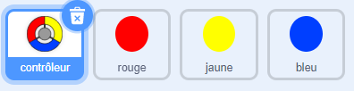
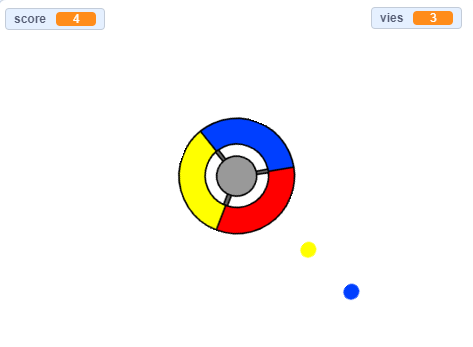

## Plus de points

--- task ---

Duplique deux fois ton sprite « rouge» et nomme les deux nouveaux sprites «jaune» et «bleu».



--- /task ---

--- task ---

Change le costume de chaque nouveau sprite pour que ce soit la bonne couleur: le sprite «jaune» doit être jaune, et le sprite «bleu» doit être bleu.

--- /task ---

--- task ---

Change le code de chaque sprite de sorte que le joueur doit faire correspondre le clone point à la bonne couleur sur le contrôleur pour marquer des points.



--- hints ---


--- hint ---

Voici le code que tu dois rechercher et modifier pour les deux nouveaux sprites:


```blocks3
    si <touching color [#FF0000]?> alors
        ajouter (1) à [score v]
        jouer le son (pop v)
...
    fin
```

--- /hint ---

--- hint ---

Voici comment tu dois changer le code pour le sprite jaune:

```blocks3
    si <couleur [#FFFF00] touchée ? :: +> alors
        ajouter (1) à [score v]
        jouer le son (pop v)
    fin
```

Voici comment tu dois changer le code pour le sprite bleu:

```blocks3
    si <couleur [#0000FF] touchée ? :: +> alors
        ajouter (1) à [score v]
        jouer le son (pop v)
    fin
```

--- /hint ---

--- /hints ---

--- /task ---

Si tu joues au jeu maintenant, tu peux voir que les points sont parfois créés l'un de l'autre.

--- task ---

Change le code du sprite «jaune» pour qu'il attende quatre secondes après que le drapeau soit cliqué avant d'apparaître.


```blocks3
    when flag clicked
    cacher
+ attendre (4) secondes
```


Puis change le code du sprite «bleu» pour qu'il attende 6 secondes après que le drapeau soit cliqué avant d'apparaître.

--- /task ---