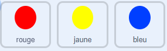

## Défi : Plus de points

Maintenant, plus le joueur joue longtemps, plus le jeu est difficile. Pour ce faire, les points apparaissent de plus en plus rapidement.

\--- task \---

Create a new `variable`{:class="block3variables"} called 'delay'.


\--- /task \---

\--- task \---

Go to the Stage's Scripts area and create a new script that sets the `delay`{:class="block3variables"} variable to `8` and then slowly reduces the value of `delay`{:class="block3variables"} while the game runs.


```blocks3
    lorsque le drapeau est cliqué sur
    réglez [délai v] sur (8)
    répétition jusqu'à < (délai) = (2)>
        attente (10) secondes
        modification [délai v] de (-0,5)
    fin
```

\--- /task \---

Notice that this code is very similar to the code you would use to create a countdown timer!

Next, use the `delay`{:class="block3variables"} variable in the code scripts of the 'red', 'yellow', and 'blue' sprites.

\--- task \---

Remove the code block that makes the game wait a random number of seconds between making the dot sprite clones. Replace the block you've removed with your new `delay`{:class="block3variables"} variable:



```blocks3
<br />- wait (pick random (5) to (10)) secondes
    wait (delay :: variables) secondes
```

Do this for all three dot sprites.

\--- /task \---

\--- task \---

Test the game, and check whether the dots begin to appear more quickly as the game goes on.

+ Est-ce que cela fonctionne pour les trois points colorés?
+ Can you see that the value of the `delay`{:class="block3variables"} variable decreases?

\--- /task \---