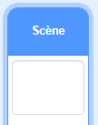
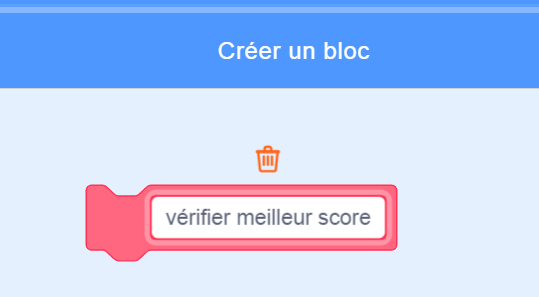

## Meilleur score

Tu vas enregistrer le meilleur score du jeu, afin que les joueurs puissent voir à quel point ils s'en sortent.

--- task ---

Crée une nouvelle variable appelée `meilleur score`{:class="block3variables"}.



--- /task ---

--- task ---

Sélectionne la scène. Clique sur 'Mes blocs' et crée un nouveau bloc personnalisé appelé `vérifier le meilleur score`{:class="block3myblocks"}.




--- /task ---

--- task ---

Ajoute du code à ton bloc personnalisé pour que le bloc vérifie si la valeur actuelle de la variable `score`{:class="block3variables"} est plus grande que la valeur de la variable `meilleur score`{:class="block3variables"}, puis stocke la valeur de `score`{:class="block3variables"} en tant que nouvelle valeur de `meilleur score`{:class="block3variables"}.


```blocks3
    définir vérifier meilleur score
    si <(score :: variables) > (meilleur score)> alors
        mettre [meilleur score v] à (score :: variables)
    fin
```

--- /task ---

--- task ---

Ajoute ton nouveau bloc personnalisé au script de la scène avant la fin du script.


```blocks3
when flag clicked
mettre (3) à [vies v]
mettre (0) à [score v]
attendre jusqu'à ce que <(vies) < (1)>
+ vérifier meilleur score :: custom
stop [tout v]
```

--- /task ---

--- task ---

Joue à ton jeu deux fois pour vérifier si ton score est correctement sauvegardé en tant que `meilleur score`{:class="block3variables"}.

--- /task ---