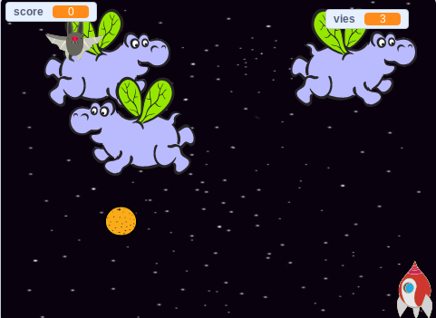

## Et ensuite?

Essaie le projet [La guerre des clones](https://projects.raspberrypi.org/fr-FR/projects/clone-wars?utm_source=pathway&utm_medium=whatnext&utm_campaign=projects) pour créer un jeu dans lequel tu dois sauver la Terre des monstres de l’espace. Dans ce projet, tu pourras utiliser ce que tu as appris sur le clonage de sprites et l’ajout d’un score!

--- no-print ---

Clique sur le drapeau vert dans le jeu en exemple ci-dessous pour démarrer, puis appuie sur les touches fléchées <kbd>gauche</kbd> et <kbd>droite</kbd> pour déplacer le vaisseau spatial et la touche <kbd>espace</kbd> pour tirer.

  <iframe allowtransparency="true" width="485" height="402" src="https://scratch.mit.edu/projects/embed/369628453/?autostart=false" frameborder="0" scrolling="no"></iframe>
  

--- /no-print ---

Marque autant de points que tu peux en tirant sur des hippopotames volants. Si tu es touché par un hippopotame ou par une orange lâchée par les chauves-souris, tu perds une vie.

--- print-only ---

--- /print-only ---

***
Ce projet a été traduit par des bénévoles:

Jonathan Vannieuwkerke

Michel Arnols

Grâce aux bénévoles, nous pouvons donner aux gens du monde entier la chance d'apprendre dans leur propre langue. Vous pouvez nous aider à atteindre plus de personnes en vous portant volontaire pour la traduction - plus d'informations sur [rpf.io/translate](https://rpf.io/translate).