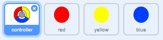

## ज़्यादा डॉट्स

\--- task \---

अपने 'red' डॉट को दो बार डुप्लिकेट करें, और दो नए स्प्राइट्स को 'yellow' और 'blue' नाम दें।



\--- /task \---

\--- task \---

प्रत्येक नए स्प्राइट की पोशाक को बदलें ताकि यह सही रंग हो: 'पीला' स्प्राइट पीला होना चाहिए, और 'ब्लू' स्प्राइट नीला होना चाहिए।

\--- /task \---

\--- task \---

प्रत्येक स्प्राइट के कोड को बदलें ताकि खिलाड़ी को अंक स्कोर करने के लिए कंट्रोलर पर सही रंग से डॉट क्लोन मिलाना पड़े।


\--- hints \---

\--- hint \---

यह वह कोड है जिसे आपको नए स्प्राइट्स खोजने और बदलने के लिए की आवश्यकता पड़ेगी:


```blocks3
    if <touching color [#FF0000]?> then
        change [score v] by (1)
        play sound (pop v)
        ...
    end
```

\--- /hint \---

\--- hint \---

इस तरह से आपको पीले स्प्राइट के लिए कोड बदलने की आवश्यकता पड़ेगी:

```blocks3
    if <touching color [#FFFF00]? :: +> then
        change [score v] by (1)
        play sound (pop v)
    end
```

यह आपको नीले स्प्राइट के लिए कोड बदलने की आवश्यकता पड़ेगी:

```blocks3
    if <touching color [#0000FF]? :: +> then
        change [score v] by (1)
        play sound (pop v)
    end
```

\--- /hint \---

\--- /hints \---

\--- /task \---

If you play the game now, you can see that the dots sometimes get created on top of each other.

\--- task \---

'yellow ’डॉट स्प्राइट के लिए कोड बदलें ताकि झंडे पर क्लिक करने के बाद वह चार सेकण्ड्स प्रतीक्षा करे और फिर दिखाई दे I


```blocks3
    when flag clicked
    hide
+   wait (4) seconds
```


'blue ’डॉट स्प्राइट के लिए कोड बदलें ताकि झंडे पर क्लिक करने के बाद वह 6 सेकण्ड्स प्रतीक्षा करे और फिर दिखाई दे।

\--- /task \---