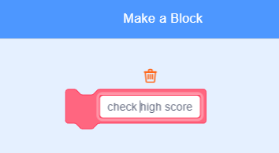

## High score

Let's save the high score, so that players can see how well they're doing.

+ Create a new variable called `high score`{:class="blockdata"}.

+ Click on your stage, and create a new custom block called `check high score`{:class="blockmoreblocks"}.
    
    

+ Just before the end of the game, add in your new custom block.
    
    

+ Add code to your custom block to store the current `score`{:class="blockdata"} as the `high score`{:class="blockdata"} `if`{:class="blockcontrol"} it's the highest score so far:
    
    ```blocks
        define [check high score]
        if <(score) > (high score)> then
            set [high score v] to (score)
        end
    ```

+ Test the code you've added. Play your game to check whether the `high score`{:class="blockdata"} is updated correctly.