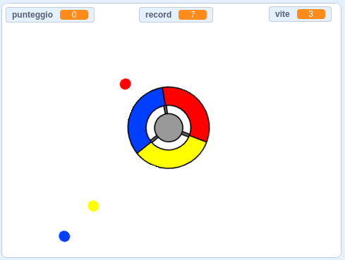

\--- no-print \---

Questa è la versione **Scratch 3** del progetto. C'è anche una versione [Scratch 2 del progetto](https://projects.raspberrypi.org/en/projects/catch-the-dots-scratch2).

\--- /no-print \---

## Introduzione

Il link 'Materiali del Progetto' per questo progetto contiene le seguenti risorse:

\--- no-print \---

Utilizzare i tasti freccia sulla tastiera per ruotare la rotellina del controller e afferrare i punti in volo quando raggiungono il centro. Se perdi tre puntini, il gioco è finito.

  <iframe allowtransparency="true" width="485" height="402" src="https://scratch.mit.edu/projects/embed/252923761/?autostart=false" frameborder="0" scrolling="no"></iframe>
  

\--- /no-print \---

\--- print-only \---

\--- /print-only \---

## \--- collapse \---

## title: Cosa imparerai

+ Come scegliere elementi casuali da un elenco
+ Come utilizzare le variabili per tenere traccia della velocità, delle vite e del punteggio del giocatore

\--- /collapse \---

## \--- collapse \---

## titolo: Di cosa avrai bisogno

### Hardware

+ Un computer in grado di eseguire Scratch 3

### Software

+ Scratch 3 ([online](http://rpf.io/scratchon){:target="_blank"} o [offline](http://rpf.io/scratchoff){:target="_ blank"})

### Download

+ [Progetto di partenza offline per Scratch 2](http://rpf.io/p/en/catch-the-dots-go){:target="_blank"}

\--- /collapse \---

## \--- collapse \---

## title: Informazioni aggiuntive per gli educatori

\--- no-print \---

Se intendete stampare questo progetto, cliccate su [Versione stampabile](https://projects.raspberrypi.org/en/projects/catch-the-dots/print).

\--- /no-print \---

Puoi trovare il [progetto completo qui](http://rpf.io/p/en/catch-the-dots-get){:target="_blank"}.

Puoi trovare il [progetto completo qui](https://scratch.mit.edu/projects/252923761/#editor){:target="_blank"}

\--- /collapse \---