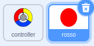
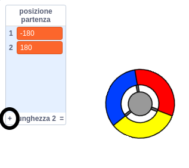

## Guadagna punti o perdi vite

Ora aggiungerai alcuni punti che il giocatore deve raccogliere.

\--- task \--- Crea un nuovo sprite chiamato 'red'. Questo sprite dovrebbe essere un piccolo punto rosso.



\--- /compito \---

\--- task \--- Aggiungi questo script al tuo sprite 'rosso' per creare un nuovo clone dello sprite ogni pochi secondi:


```blocks3
    quando il flag ha fatto clic
    nascondi
    aspetta (2) secondi
    per sempre
        crea clone di (io stesso v)
        aspetti (scegli casuale (5) a (10)) secondi
    fine
```

\--- /compito \---

Se fai clic sulla bandiera verde ora, sembra che non stia succedendo nulla. Questo perché tutti gli sprite clonati sono nascosti e appaiono nello stesso posto.

Stai per aggiungere codice per far apparire ogni nuovo clone in uno dei quattro angoli dello stage.


\--- task \--- Crea una nuova lista chiamata `start position`{: class = "block3variables"}, fai clic sull'icona `(+) della lista` per aggiungere i valori `-180`{: class = "block3variables" } e `180`{: class = "block3variables"}.




[[[generic-scratch3-make-list]]]

Quindi puoi nascondere l'elenco deselezionando questa casella:

 \--- /compito \---

Si noti che le coordinate per ciascun angolo dello stage sono una combinazione di `180` e `-180`. Ciò significa che puoi usare l'elenco per scegliere un angolo dello stage a caso.

\--- task \--- Aggiungi questo codice allo sprite 'punto' per far apparire ogni nuovo clone sprite in un angolo casuale e poi lentamente verso lo sprite del controller.


```blocks3
    quando inizio come clone
    vai a x: (elemento (scegli casuale (1) a (2)) di [posizioni iniziali v]) y: (elemento (scegli casuale (1) a (2)) di [posizioni iniziali v])
    punto verso (controller v)
    mostra
    ripeti fino a <touching (controller v)?>
        sposta (1) passi
    fine
```

\--- / task \--- Questo nuovo codice sceglie `-180` o `180` per le posizioni x e y, il che significa che ogni clone sprite 'punto' inizia in un angolo dello stage.

\--- task \--- Metti alla prova il tuo progetto. Dovresti vedere i punti rossi apparire negli angoli dello stage e spostarti lentamente verso il controller.

 \--- /compito \---

\--- task \--- Crea due nuove variabili chiamate `lives`{: class = "block3variables"} e `score`{: class = "block3variables"}.

 \--- /compito \---

\--- task \--- Aggiungi il codice al tuo Stage per impostare la variabile `lives`{: class = "block3variables"} a `3` e il punteggio ``{: class = "block3variables"} a `0` a l'inizio del gioco. 

```blocks3
quando il flag ha fatto clic su
set [lives v] su (3)
set [score v] to (0)
```

\--- /compito \---

\--- task \--- Aggiungi questo codice alla fine dello script dello Stage per far finire il gioco quando il giocatore perde l'ultima vita:


```blocks3
    attendere fino a <(lives :: variables) < [1]>
    stop [all v]
```

\--- /compito \---

Il giocatore dovrebbe vincere punti per prendere punti e perdere punti vita per non aver preso punti. Un punto può essere catturato solo facendo corrispondere il colore del controller al colore del punto.

\--- \--- compito Torna il 'rosso' area di script di sprite punto per aggiungere alcuni blocchi di codice alla fine dello sprite del `quando inizio come un clone`{: class = "block3control"} script.

Per prima cosa, fai il punto clone `muovi 5 passi`{: class = "block3motion"} in modo che si sovrapponga al controller.

Quindi aggiungi il codice per aggiungere `1` o `punteggio`{: class = "block3variables"} se il colore del punto clone corrisponde al colore del controller quando toccano, o per prendere `1` lontano da `vite`{ : class = "block3variables"} se i loro colori non corrispondono.

[[[generic-scratch3-sound-from-library]]]


```blocks3
    move (5) passi
    se <touching color [#FF0000]?> poi
        cambia [punteggio v] per (1)
        suono riproduzione (pop v) fino a quando
    altro
        cambia [v v v] di (-1)
        suono riproduzione (Laser1 v) finché non viene eseguito
    fine
    cancella questo clone
```

\--- /compito \---

\--- compito \---

Metti alla prova il tuo gioco per assicurarti di perdere una vita se non trovi un punto con il colore corretto e di segnare un punto se abbini correttamente un punto.

\--- /compito \---