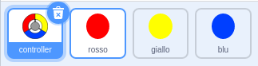

## Più punti

\--- task \--- Duplica il tuo sprite di punti 'red' due volte, e dai il nome ai due nuovi sprite 'yellow' e 'blue'.

 \--- /compito \---

\--- task \--- Cambia il costume di ogni nuovo sprite in modo che sia il colore corretto: lo sprite 'giallo' dovrebbe essere giallo, e lo sprite 'blu' dovrebbe essere blu. \--- /compito \---

\--- task \--- Modificare il codice di ciascun sprite in modo che il giocatore debba abbinare il clone di punti al colore corretto sul controller per ottenere punti.


\--- suggerimenti \--- \--- suggerimento \--- Questo è il codice che devi trovare e modificare per entrambi i nuovi folletti:


```blocks3
    se <touching color [#FF0000]?> allora
        cambia [punteggio v] per (1)
        suono riprodotto (pop v)
...
    fine
```

\--- / suggerimento \--- \--- suggerimento \--- Ecco come è necessario modificare il codice per lo sprite giallo:

```blocks3
    se <tocca il colore [# FFFF00]? :: +> quindi
        modifica [punteggio v] per (1)
        suono riproduzione (pop v)
    fine
```

Ecco come è necessario modificare il codice per lo sprite blu:

```blocks3
    se <tocca il colore [# 0000FF]? :: +> quindi
        modifica [punteggio v] per (1)
        suono riproduzione (pop v)
    fine
```

\--- / suggerimento \--- \--- / suggerimenti \--- \--- / compito \---

Se giochi ora, puoi vedere che i punti a volte vengono creati uno sopra l'altro.

\--- task \--- Cambia il codice per lo sprite di punti "giallo" in modo che resti in attesa per quattro secondi dopo che il flag è stato premuto prima di apparire.


```blocks3
    quando il flag ha cliccato
    nascondi
+ aspetta (4) secondi
```


Quindi cambia il codice per il punto blu "sprite" in modo che resti in attesa 6 secondi dopo che il flag è stato premuto prima di apparire.

\--- /compito \---