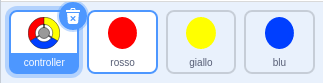
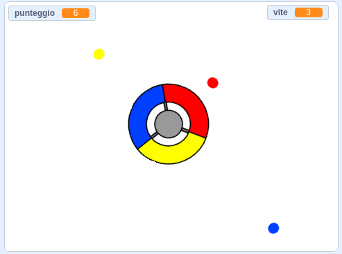

\--- challenge \---

## Challenge: More dots

Duplicate your 'red' dot sprite twice, and name the two new sprites 'yellow' and 'blue'.

Edit these sprites (including their code), so that each coloured dot has to match the correct colour on the controller. Remember to test your project, making sure you gain points and lose lives at the right times, and that your game isn't too easy or too hard!

\--- /challenge \---