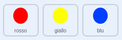

## Aumentare la difficoltà

Ora renderai il gioco più difficile più a lungo il giocatore lo gioca. Lo farai facendo apparire i punti sempre più velocemente nel tempo.

\--- task \---

Create a new `variable`{:class="block3variables"} called 'delay'.


\--- /task \---

\--- task \---

Go to the Stage's Scripts area and create a new script that sets the `delay`{:class="block3variables"} variable to `8` and then slowly reduces the value of `delay`{:class="block3variables"} while the game runs.


```blocks3
    quando il flag ha cliccato
    impostato [delay v] to (8)
    repeat fino a < (delay) = (2)>
        wait (10) secondi
        change [delay v] di (-0.5)
    end
```

\--- /task \---

Notice that this code is very similar to the code you would use to create a countdown timer!

Next, use the `delay`{:class="block3variables"} variable in the code scripts of the 'red', 'yellow', and 'blue' sprites.

\--- task \---

Remove the code block that makes the game wait a random number of seconds between making the dot sprite clones. Replace the block you've removed with your new `delay`{:class="block3variables"} variable:



```blocks3
<br />- wait (seleziona casuale (5) a (10)) sec
    wait (delay :: variables) secs
```

Do this for all three dot sprites.

\--- /task \---

\--- task \---

Test the game, and check whether the dots begin to appear more quickly as the game goes on.

+ Funziona per tutti e tre i punti colorati?
+ Can you see that the value of the `delay`{:class="block3variables"} variable decreases?

\--- /task \---