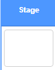
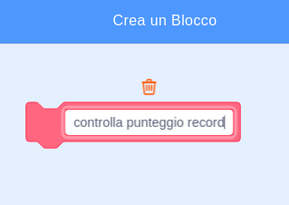

## Punteggio record

Stai per salvare il punteggio record del gioco, in modo che i giocatori possano vedere quanto stanno migliorando.

--- task ---

Crea una nuova variabile chiamata `punteggio record`{:class="block3variables"}.



--- /task ---

--- task ---

Seleziona lo Stage. Clicca su 'I Miei Blocchi' e crea un nuovo blocco personalizzato chiamato `controlla punteggio record`{:class="block3myblocks"}.




--- /task ---

--- task ---

Aggiungi un codice al tuo blocco personalizzato in modo che il blocco controlli se il valore attuale di `punteggio`{:class="block3variables"} è più grande del valore della variabile `punteggio record`{:class="block3variables"}, e poi memorizza il valore di `punteggio`{:class="block3variables"} come nuovo valore di `punteggio record`{:class="block3variables"}.


```blocks3
    define check punteggio record
    if <(punteggio :: variables) > (punteggio record)> then
        set [punteggio record v] to (punteggio :: variables)
    end
```

--- /task ---

--- task ---

Aggiungi il tuo nuovo blocco personalizzato allo script Stage prima della fine dello script.


```blocks3
when flag clicked
set [vite v] to (3)
set [punteggio v] to (0)
wait until <(vite) < (1)>

+ check punteggio record :: custom
stop [tutto v]
```

--- /task ---

--- task ---

Gioca due volte al tuo gioco per verificare se il tuo punteggio viene salvato correttamente come il punteggio `punteggio record`{:class="block3variables"}.

--- /task ---