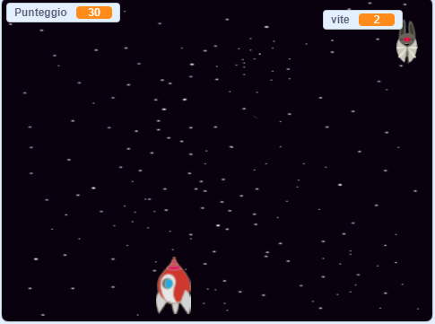

## E adesso?

Prova il progetto [Clone wars](https://projects.raspberrypi.org/en/projects/clone-wars?utm_source=pathway&utm_medium=whatnext&utm_campaign=projects) per creare un gioco in cui devi salvare la Terra da mostri spaziali. In quel progetto, sarai in grado di usare ciò che hai imparato sulla clonazione degli sprite e l'aggiunta di un punteggio!

\--- no-print \---

Per iniziare clicca sulla bandierina verde nel gioco di esempio qui sotto, poi premi i tasti freccia <kbd>sinistra</kbd> e <kbd>destra</kbd> per spostare la navicella, e il tasto <kbd>spazio</kbd> per sparare.

  <iframe allowtransparency="true" width="485" height="402" src="https://scratch.mit.edu/projects/embed/276887163/?autostart=false" frameborder="0" scrolling="no"></iframe>
  

\--- /no-print \---

Fai più punti che puoi sparando agli ippopotami spaziali volanti. Se si viene colpiti da un ippopotamo o da una arancia lanciata dai pipistrelli, si perde una vita.

\--- print-only \---

\--- /print-only \---