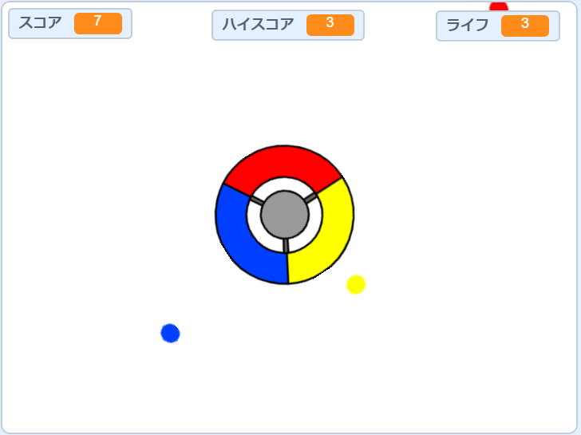

\--- no-print \---

これはプロジェクトの**Scratch 3**バージョンです。 [Scratch 2バージョンのプロジェクト](https://projects.raspberrypi.org/en/projects/catch-the-dots-scratch2)もあります。

\--- /no-print \---

## はじめに

このプロジェクトでは、プレーヤーが色付きのドットをコントローラーホイールの正しい色に合わせるゲームを作成する方法を学びます。

\--- no-print \---

キーボードの矢印キーを使用してコントローラホイールを回転させ、中心に飛んでくるドットをキャッチします。 あなたが3回間違えたら、ゲームは終わりです。

  <iframe allowtransparency="true" width="485" height="402" src="https://scratch.mit.edu/projects/embed/252923761/?autostart=false" frameborder="0" scrolling="no"></iframe>
  

\--- /no-print \---

\--- print-only \---

\--- /print-only \---

## \--- collapse \---

## title: 学習すること

+ リストからランダムなアイテムを選択する方法
+ スピード、ライフ、そしてプレイヤーのスコアを追跡するための変数の使い方

\--- /collapse \---

## \--- collapse \---

## title: 必要なもの

### ハードウェア

+ Scratch 3を実行できるコンピュータ

### ソフトウェア

+ Scratch 3 ([オンライン](http://rpf.io/scratchon){:target="_blank"}または[オフライン](http://rpf.io/scratchoff){:target="_blank"})

### ダウンロード

+ [オフラインScratch 2プロジェクト](http://rpf.io/p/en/catch-the-dots-go){:target="_blank"}

\--- /collapse \---

## \--- collapse \---

## title: 教育者向けの追加情報

\--- no-print \---

このプロジェクトを印刷する必要がある場合は、 [印刷用バージョン](https://projects.raspberrypi.org/en/projects/catch-the-dots/print)を使用してください。

\--- /no-print \---

[完成したプロジェクトはこちらに](http://rpf.io/p/en/catch-the-dots-get){:target="_blank"}あります 。

[完成したプロジェクトはこちらに](https://scratch.mit.edu/projects/252923761/#editor){:target="_blank"}あります 。

\--- /collapse \---