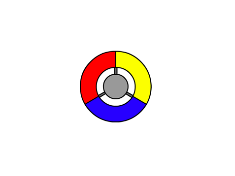

## コントローラーを作成する

プレイヤーがドットを集めるために使用するコントローラを作成することから始めます。

\--- task \---

「Catch the dots」Scratchスタータープロジェクトを開きます。

**Online:** [rpf.io/dots-on](http://rpf.io/dots-on){:target="_blank"}にあるスタータープロジェクトを開きます。

Scratchアカウントをお持ちの場合は**リミックス**をクリックしてコピーを作成できます。

**Offline:** [rpf.io/p/en/catch-the-dots-go](http://rpf.io/p/en/catch-the-dots-go)からスタータープロジェクトをダウンロードして、オフラインエディターで開きます。

Scratchオフラインエディタをダウンロードしてインストールする必要がある場合は、[rpf.io/scratchoff](http://rpf.io/scratchoff)にあります。

\--- /task \---

コントローラのスプライトが見えるはずです。



\--- task \---

いくつかのコードをコントローラーのスプライトに追加して、プレーヤーが右矢印キーを押したときにスプライトが右に回転するようにします。


```blocks3
    旗が押されたとき
ずっと
    もし<key (right arrow v) pressed?>なら
        右回りに(3) 度回す
    end
end
```

\--- /task \---

\--- task \---

コードをテストしましょう。 右矢印キーを押すと、コントローラーが右に回転するはずです。

\--- /task \---

\--- task \---

コードをコントローラーのスプライトに追加して、プレーヤーが左矢印キーを押したときにスプライトが左に回転するようにします。


\--- hints \---

\--- hint \---

右矢印キーが押されたかどうかをチェックし、スプライトを右に回すコードを見つけます。 このコードのコピーを追加し、そのコピーを変更して、左矢印キーが押されたかどうかをチェックし、スプライトを左に回すことができますか？

\--- /hint \---

\--- hint \---

必要なブロックは次のとおりです。

```blocks3
<key (space v) pressed?>

左回りに(15) 度回す

もし<> なら

end
```

\--- /hint \---

\--- hint \---

コードは次のようになります。

```blocks3
    旗が押されたとき
    ずっと
        もし<key (right arrow v) pressed?> なら
            右回りに(3) 度回す
        end

+   もし<key (left arrow v) pressed?> なら
            左回りに(3) 度回す
        end
    end
```

\--- /hint \---

\--- /hints \---

\--- /task \---