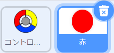
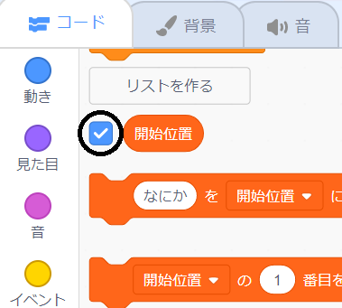

## ポイントを獲得するか、ライフを失います

次に、プレーヤーが集める必要があるいくつかのドットを追加します。

\--- task \---

「赤」という新しいスプライトを作成します。 このスプライトは小さな赤いドットである必要があります。



\--- /task \---

\--- task \---

このスクリプトを「赤」スプライトに追加して、数秒ごとにスプライトの新しいクローンを作成します。


```blocks3
    旗が押されたとき
    隠す
    (2) 秒待つ
    ずっと 
        (自分自身 v) のクローンを作る
        ((5) から (10) までの乱数) 秒待つ
    end
```

\--- /task \---

ここで緑色の旗を押しても、何も起きていないように見えます。 これは、クローンされたスプライトがすべて非表示になり、同じ場所に表示されるためです。

新しいクローンをステージの四隅のいずれかに表示するためのコードを追加します。


\--- task \---

`開始位置` {:class="block3variables"}と呼ばれる新しいリストを作成します、リストの`(+) `アイコンをクリックし値`-180`{:class="block3variables"}および`180` {:class="block3variables"}を追加します。


[[[generic-scratch3-make-list]]]

次に、このボックスを選択解除してリストを非表示にできます。



\--- /task \---

ステージの四隅の座標は、`180` と`-180` の組み合わせであることに注意してください。 つまり、リストを使用して、ステージの四隅をランダムに選択できます。

\--- task \---

このコードをドットのスプライトに追加して、新しいスプライトクローンをランダムに四隅に表示し、コントローラースプライトに向かってゆっくりと移動するようにします。


```blocks3
    クローンされたとき
    x座標を ([開始位置 v] の ((1) から (2) までの乱数) 番目) 、y座標を ([開始位置 v] の ((1) から (2) までの乱数) 番目) にする
    (コントローラー v) へ向ける
    表示する
    <touching (controller v)?> まで繰り返す 
        (1) 歩動かす
    end
```

\--- /task \---

この新しいコードは、 xおよびyの位置として`-180` または`180` のいずれかを選択します、つまり、各「ドット」スプライトクローンはステージの隅から始まります。

\--- task \---

プロジェクトをテストします。 ステージの隅に赤い点が表示され、コントローラーに向かってゆっくりと移動するはずです。


\--- /task \---

\--- task \---

`ライフ` {：class = "block3variables"}および`スコア` {:class="block3variables"}いう2つの新しい変数を作成します。


\--- /task \---

\--- task \---

ステージにコードを追加して、`ライフ` {:class="block3variables"}変数を`3 `設定します、さらにゲームの開始時に`スコア` {:class="block3variables"}を`0`設定します。 

```blocks3
旗が押されたとき
[ライフ v] を (3) にする
[スコア v] を (0) にする
```

\--- /task \---

\--- task \---

このコードをステージのスクリプトの最後に追加して、プレーヤーが最後のライフを失ったときにゲームを終了させます:


```blocks3
    < (ライフ :: 変数) < [1]> まで待つ
[すべてを止める v]
```

\--- /task \---

プレーヤーはドット捕まえるとポイントを獲得し、ドットを捕まえられなかったらライフを失います。 ドットは、コントローラーの色とドットの色が一致したときのみ捕まえられます。

\--- task \---

「赤」ドットスプライトのスクリプト領域に戻り、`クローンスクリプトとして開始するとき` {:class="block3control"}のスクリプトの最後にいくつかのコードブロックを追加します。

まず、ボールのドットクローンを`5歩動かし`{:class="block3motion"}、コントローラーと重なるようにします。

次に、ドットクローンとコントローラーが触れたとき、それぞれの色が一致したならば、`スコア` {:class="block3variables"}に`1`を加える、または、それぞれの色が一致しなければ`ライフ` {:class="block3variables"}から`1`を減らすようにします。

[[[generic-scratch3-sound-from-library]]]


```blocks3
    (5) 歩動かす
    もし <touching color [#FF0000]?> なら 
        [スコア v] を (1) ずつ変える
        終わるまで (pop v) の音を鳴らす
    でなければ 
        [ライフ v] を (-1) ずつ変える
        終わるまで (Laser1 v) の音を鳴らす
    end
このクローンを削除する
```

\--- /task \---

\--- task \---

ゲームをテストして、次のことを確認します。

1. ドットと正しい色を一致させないと、ライフを失います
2. ドットを正しく一致させるとポイントを獲得します

\--- /task \---