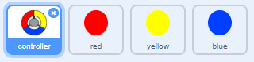
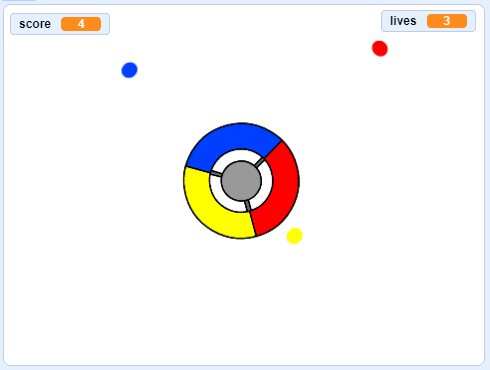
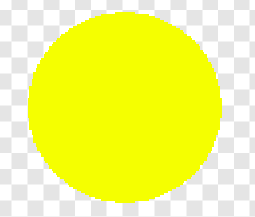
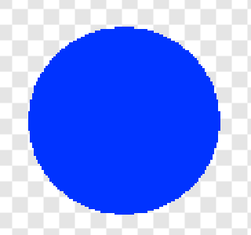

## より多くのドット

--- task ---

「赤」のドットスプライトを2回複製し、2つの新しいスプライトに「黄」と「青」という名前を付けます。



--- /task ---

--- task ---

それぞれの新しいスプライトのコスチュームを正しい色になるように変更します。「黄」のスプライトは黄色に、「青」のスプライトは青色になります。

--- /task ---

--- task ---

各スプライトのコードを変更して、プレーヤーがドットクローンをコントローラー上の正しい色に合わせてポイントを獲得するようにします。



--- hints ---


--- hint ---

これは、両方の新しいスプライトで、見つけて変更する必要があるコードです。


```blocks3
	if <touching color [#FF0000]?> then
		change [スコア v] by (1)
		play sound (pop v)
        ...
	end
```

--- /hint ---

--- hint ---

これは、黄色のスプライトのコードを変更する方法です。

```blocks3
	if <touching color [#FFFF00]? :: +> then
        change [スコア v] by (1)
        play sound (pop v)
	end
```

これが、青色のスプライトのコードを変更する方法です。

```blocks3
	if <touching color [#0000FF]? :: +> then
        change [スコア v] by (1)
        play sound (pop v)
	end
```

--- /hint ---

--- /hints ---

--- /task ---

ここでゲームをプレイすると、ドットが時々上下に作成されることがわかります。

--- task ---

「黄」のドットスプライトのコードを変更して、フラグが押されてから4秒待ってから表示されるようにします。



```blocks3
	when flag clicked
	hide
+	wait (4) seconds
```



次に、「青」ドットスプライトのコードを変更して、フラグが押されてから6秒待ってから表示されるようにします。

--- /task ---