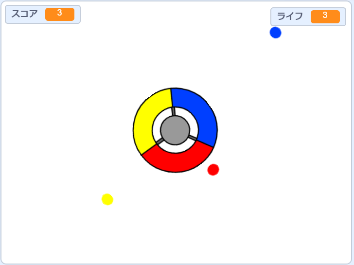
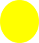

## より多くのドット

\--- task \---

「赤」のドットスプライトを2回複製し、2つの新しいスプライトに「黄」と「青」という名前を付けます。


\--- /task \---

\--- task \---

それぞれの新しいスプライトのコスチュームを正しい色になるように変更します。「黄」のスプライトは黄色に、「青」のスプライトは青色になります。

\--- /task \---

\--- task \---

各スプライトのコードを変更して、プレーヤーがドットクローンをコントローラー上の正しい色に合わせてポイントを獲得するようにします。



\--- hints \---

\--- hint \---

これは、両方の新しいスプライトで、見つけて変更する必要があるコードです。


```blocks3
    もし <touching color [#FF0000]?> なら 
    [スコア v] を (1) ずつ変える
    (pop v) の音を鳴らす
  . . .
    end
```

\--- /hint \---

\--- hint \---

これは、黄色のスプライトのコードを変更する方法です。

```blocks3
    もし < [#FFFF00]色に触れたなら? :: +> のとき
    [スコア v] を (1) ずつ変える
    (pop v) の音を鳴らす
end
```

これが、青色のスプライトのコードを変更する方法です。

```blocks3
    もし < [#0000FF]色に触れたなら? :: +> のとき
    [スコア v] を (1) ずつ変える
    (pop v) の音を鳴らす
end
```

\--- /hint \---

\--- /hints \---

\--- /task \---

ここでゲームをプレイすると、ドットが時々上下に作成されることがわかります。

\--- task \---

「黄」のドットスプライトのコードを変更して、フラグが押されてから4秒待ってから表示されるようにします。



```blocks3
    旗が押されたとき
    隠す
+   (4) 秒待つ
```


次に、「青」ドットスプライトのコードを変更して、フラグが押されてから6秒待ってから表示されるようにします。

\--- /task \---