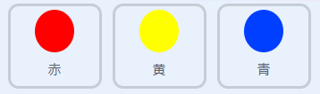

## 難易度を上げる

次に、プレイヤーがプレイする時間が長いほど、ゲームをより難しくします。 これを行うには、ドットが次第に速く表示されるようにします。

--- task ---

新しい「遅れ」`変数`{:class="block3variables"}を作成します。


--- /task ---

--- task ---

ステージのスクリプト領域に移動し、新しいスクリプトを作成します。`遅れ`{:class="block3variables"}変数を`8` に設定し、ゲームの実行中に`遅れ`{:class="block3variables"}の値をゆっくりと減らします。


```blocks3
    ⚑ がおされたとき
    [遅れ v] を (8) にする
    < (遅れ) = (2)> まで繰り返す 
    (10) 秒待つ
    [遅れ v] を (-0.5) ずつ変える
end
```

--- /task ---

このコードは、カウントダウンタイマーの作成に使用するコードと非常に似ていることに注意してください。

次に、「赤」、「黄」、および「青」のスプライトのコードスクリプト内で `遅れ`{:class="block3variables"}変数を使用します。

--- task ---

ドットスプライトのクローンを作成する間にゲームをランダムな秒数だけ待機させるコードブロックを削除します。 そして削除したブロックを新しい`遅れ`{:class="block3variables"}変数に置き換えます。



```blocks3
-   ((5) から (10) までのらんすう) びょうまつ
    (遅れ :: variables) びょうまつ
```

これを3つのドットスプライトすべてに対して行います。

--- /task ---

--- task ---

ゲームをテストし、ゲームが進むにつれてドットがより早く現れ始めるかどうかを確認します。

+ これは、3つの色付きドットすべてで機能しますか？
+ `遅れ`{:class="block3variables"}変数の値が減少するのがわかりますか？

--- /task ---