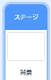

## 難易度を上げる

次に、プレイヤーがプレイする時間が長いほど、ゲームをより難しくします。 これを行うには、カラーボールが次第に速く表示されるようにします。

\--- task \---

Create a new `variable`{:class="block3variables"} called 'delay'.



\--- /task \---

\--- task \---

Go to the Stage's Scripts area and create a new script that sets the `delay`{:class="block3variables"} variable to `8` and then slowly reduces the value of `delay`{:class="block3variables"} while the game runs.


```blocks3
    緑の旗が押されたとき
変数「おくれ」を8にする
おくれ=2になるまで繰り返す
10秒待つ
おくれを-0.5ずつ変える
```

\--- /task \---

Notice that this code is very similar to the code you would use to create a countdown timer!

Next, use the `delay`{:class="block3variables"} variable in the code scripts of the 'red', 'yellow', and 'blue' sprites.

\--- task \---

Remove the code block that makes the game wait a random number of seconds between making the dot sprite clones. Replace the block you've removed with your new `delay`{:class="block3variables"} variable:


```blocks3
<br />5から10までの乱数秒待つ
変数「おくれ」秒待つ
```

Do this for all three dot sprites.

\--- /task \---

\--- task \---

Test the game, and check whether the dots begin to appear more quickly as the game goes on.

+ これは、3つのカラーボールすべてで機能しますか？
+ Can you see that the value of the `delay`{:class="block3variables"} variable decreases?

\--- /task \---