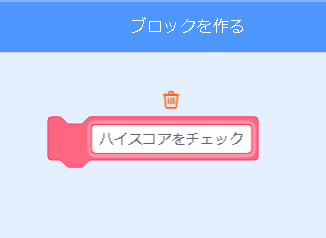

## ハイスコア

ゲームのハイスコアを保存して、プレイヤーがどれだけうまくやっているかを確認できるようにします。

--- task ---

`ハイスコア`{:class="block3variables"}という新しい変数を作成します。


--- /task ---

--- task ---

ステージを選択します。 「マイブロック」を押して、`ハイスコアをチェック`{:class="block3myblocks"}という新しいカスタムブロックを作成します。




--- /task ---

--- task ---

カスタムブロックにコードを追加して、ブロックが`スコア`{:class="block3variables"}の値が、`ハイスコア`{:class="block3variables"}変数の値よりも大きいかチェックし、その時は`スコア`{:class="block3variables"}の値を `ハイスコア`{:class="block3variables"}の新しい値として保存します。


```blocks3
ていぎ ハイスコアをチェック
もし <(スコア :: variables) > (ハイスコア)> なら 
  [ハイスコア v] を (スコア :: variables) にする
end
```

--- /task ---

--- task ---

スクリプトの最後の前に、ステージスクリプトに新しいカスタムブロックを追加します。


```blocks3
⚑ がおされたとき
[ライフ v] を (3) にする
[スコア v] を (0) にする
< (ライフ) < (1)> まで待つ
+ ハイスコアをチェック :: custom
ストップ [全て v]
```

--- /task ---

--- task ---

ゲームを2回プレイして、スコアが`ハイスコア`{:class="block3variables"}として正しく保存されるかどうかを確認します。

--- /task ---