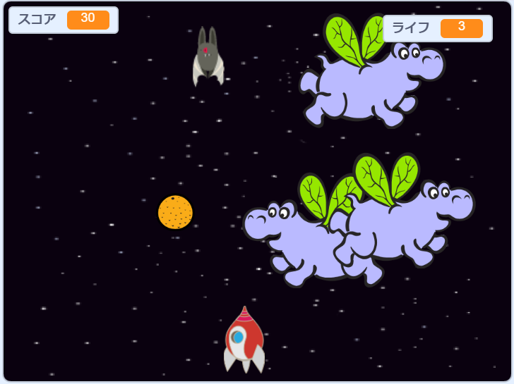

## 次は何をしますか？

「クローン戦争」プロジェクトを試して、宇宙モンスターから地球を救わなければならないゲームを作りましょう。 そのプロジェクトでは、スプライトのクローン作成とスコアの追加について学んだことを使用できます！

印刷はありません

下のサンプルゲームの緑色の旗を押して開始し、左右の矢印キーを押して宇宙船を移動し、スペースキーを押して射撃します。

  <iframe allowtransparency="true" width="485" height="402" src="https://scratch.mit.edu/projects/embed/276887163/?autostart=false" frameborder="0" scrolling="no"></iframe>
  

印刷はありません

空飛ぶカバを撃つことで、できるだけ多くのポイントを獲得してください。 カバやコウモリが落としたオレンジに当たった場合、命を失います。

印刷のみ

印刷のみ