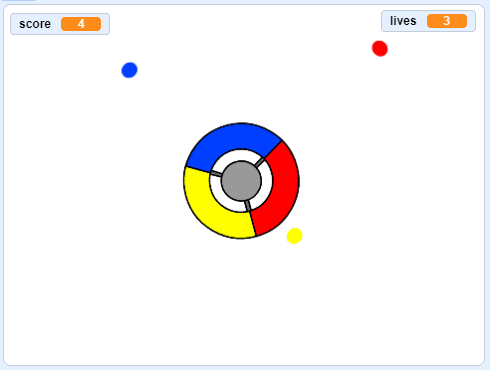

## ಹೆಚ್ಚು ಚುಕ್ಕೆಗಳು

--- task ---

ನಿಮ್ಮ 'red'(ಕೆಂಪು) ಡಾಟ್ sprite ಅನ್ನು ಎರಡು ಬಾರಿ ನಕಲು ಮಾಡಿ, ಮತ್ತು ಎರಡು ಹೊಸ sprites 'yellow'(ಹಳದಿ) ಮತ್ತು 'blue'(ನೀಲಿ) ಎಂದು ಹೆಸರಿಸಿ.


--- /task ---

--- task ---

ಬದಲಾಯಿಸಿ costume ಪ್ರತಿ ಹೊಸ sprite ಆದ್ದರಿಂದ ಇದು ಸರಿಯಾದ ಬಣ್ಣ: 'yellow'(ಹಳದಿ) sprite yellow(ಹಳದಿ) ಮತ್ತು 'blue'(ನೀಲಿ) sprite blue(ನೀಲಿ) ಬಣ್ಣದ್ದಾಗಿರಬೇಕು.

--- /task ---

--- task ---

ಪ್ರತಿ sprite ಕೋಡ್ ಬದಲಾಯಿಸಿ ಆದ್ದರಿಂದ ಆಟಗಾರನು ಡಾಟ್‌ಗೆ ಹೊಂದಿಕೆಯಾಗಬೇಕು clone ಅಂಕಗಳನ್ನು ಗಳಿಸಲು ನಿಯಂತ್ರಕದಲ್ಲಿ ಸರಿಯಾದ ಬಣ್ಣಕ್ಕೆ.



--- hints ---


--- hint ---

ಎರಡೂ ಹೊಸ sprites ‌ಗಳಿಗಾಗಿ ನೀವು ಕಂಡು ಹಿಡಿಯಬೇಕಾದ ಮತ್ತು ಬದಲಾಯಿಸಬೇಕಾದ ಕೋಡ್ ಇದು:


```blocks3
    if <touching color [#FF0000]?> then
        change [score v] by (1)
        play sound (pop v)
        ...
    end
```

--- /hint ---

--- hint ---

Yellow sprite(ಹಳದಿ ಸ್ಪ್ರೈಟ್ಗಾಗಿ) ನೀವು ಕೋಡ್ ಅನ್ನು ಹೇಗೆ ಬದಲಾಯಿಸಬೇಕು:

```blocks3
    if <touching color [#FFFF00]? :: +> then
        change [score v] by (1)
        play sound (pop v)
    end
```

Blue (ನೀಲಿ) sprite ಗಾಗಿ ನೀವು ಕೋಡ್ ಅನ್ನು ಹೀಗೆ ಬದಲಾಯಿಸಬೇಕು:

```blocks3
    if <touching color [#0000FF]? :: +> then
        change [score v] by (1)
        play sound (pop v)
    end
```

--- /hint ---

--- /hints ---

--- /task ---

ನೀವು ಈಗ ಆಟವನ್ನು ಆಡುತ್ತಿದ್ದರೆ, ಚುಕ್ಕೆಗಳು ಕೆಲವೊಮ್ಮೆ ಒಂದರ ಮೇಲೊಂದು ರಚನೆಯಾಗುವುದನ್ನು ನೀವು ನೋಡಬಹುದು.

--- task ---

ಕೋಡ್ ಬದಲಾಯಿಸಿ 'yellow'(ಹಳದಿ) dot sprite ಆದ್ದರಿಂದ ಗೋಚರಿಸುವ ಮೊದಲು ಧ್ವಜವನ್ನು ಕ್ಲಿಕ್ ಮಾಡಿದ ನಂತರ ಅದು ನಾಲ್ಕು ಸೆಕೆಂಡುಗಳ ಕಾಲ ಕಾಯುತ್ತದೆ.


```blocks3
    when flag clicked
    hide
+   wait (4) seconds
```


ನಂತರ 'blue' ಡಾಟ್ ಸ್ಪ್ರೈಟ್‌ಗಾಗಿ ಕೋಡ್ ಅನ್ನು ಬದಲಾಯಿಸಿ ಇದರಿಂದ ಧ್ವಜವು(flag) ಕಾಣಿಸಿಕೊಳ್ಳುವ ಮೊದಲು ಕ್ಲಿಕ್ ಮಾಡಿದ 6 ಸೆಕೆಂಡುಗಳವರೆಗೆ ಕಾಯುತ್ತದೆ.

--- /task ---