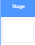

## ಕಷ್ಟವನ್ನು ಹೆಚ್ಚಿಸಿ

ಈಗ ನೀವು ಆಟಗಾರನು ಹೆಚ್ಚು ಸಮಯದವರೆಗೆ ಆಟವನ್ನು ಹೆಚ್ಚು ಕಷ್ಟಕರವಾಗಿಸಲಿದ್ದೀರಿ. ಸ್ವಲ್ಪ ಸಮಯ ನಂತರದಲ್ಲಿ ಚುಕ್ಕೆಗಳು ವೇಗವಾಗಿ ಗೋಚರಿಸುವ ಮೂಲಕ ನೀವು ಇದನ್ನು ಮಾಡುತ್ತೀರಿ.

--- task ---

ಹೊಸದನ್ನು ರಚಿಸಿ `variable`{:class="block3variables"}ಕರೆಯಲಾಗುತ್ತದೆ 'delay'.



--- /task ---

--- task ---

ಹಂತದ ಸ್ಕ್ರಿಪ್ಟ್‌ಗಳ ಪ್ರದೇಶಕ್ಕೆ ಹೋಗಿ ಮತ್ತು ಹೊಸ ಸ್ಕ್ರಿಪ್ಟ್‌ ಅನ್ನು ರಚಿಸಿ `delay`{:class="block3variables"} ವೇರಿಯಬಲ್ ಗೆ `8` ಮತ್ತು ನಂತರ ನಿಧಾನವಾಗಿ ಮೌಲ್ಯವನ್ನು ಕಡಿಮೆ ಮಾಡುತ್ತದೆ `delay`{:class="block3variables"} ಸಮಯದ ಆಟದ runs.


```blocks3
    when flag clicked
    set [delay v] to (8)
    repeat until < (delay) = (2)>
        wait (10) seconds
        change [delay v] by (-0.5)
    end
```

--- /task ---

ಕೌಂಟ್ಡೌನ್ ಟೈಮರ್ ರಚಿಸಲು ನೀವು ಬಳಸುವ ಕೋಡ್‌ಗೆ ಈ ಕೋಡ್ ತುಂಬಾ ಹೋಲುತ್ತದೆ ಎಂಬುದನ್ನು ಗಮನಿಸಿ!

ಮುಂದೆ, ಬಳಸಿ `delay`{:class="block3variables"} ವೇರಿಯಬಲ್ 'red'(ಕೆಂಪು), 'yellow'(ಹಳದಿ) ಮತ್ತು 'blue'(ನೀಲಿ) sprites ಕೋಡ್ ಸ್ಕ್ರಿಪ್ಟ್‌ಗಳಲ್ಲಿ.

--- task ---

ತೆಗೆದುಹಾಕಿ ಕೋಡ್ ಬ್ಲಾಕ್ ಅದು ಆಟವನ್ನು ಕಾಯುವಂತೆ ಮಾಡುತ್ತದೆ ರ್ಯಾಂಡಮ್ ಸಂಖ್ಯೆ ಚುಕ್ಕೆ ಮಾಡುವ ನಡುವೆ ಸೆಕೆಂಡುಗಳ sprite clones. ನೀವು ತೆಗೆದುಹಾಕಿದ ಬ್ಲಾಕ್ ಅನ್ನು ನಿಮ್ಮ ಹೊಸದರೊಂದಿಗೆ ಬದಲಾಯಿಸಿ `delay`{:class="block3variables"} ವೇರಿಯಬಲ್:


```blocks3
<br />-   wait (pick random (5) to (10)) secs
    wait (delay :: variables) secs
```

ಎಲ್ಲಾ ಮೂರು ಡಾಟ್ sprite ಗಳಿಗೆ ಇದನ್ನು ಮಾಡಿ.

--- /task ---

--- task ---

ಆಟವನ್ನು ಪರೀಕ್ಷಿಸಿ, ಮತ್ತು ಆಟ ಮುಂದುವರೆದಂತೆ ಚುಕ್ಕೆಗಳು ಬೇಗನೆ ಕಾಣಿಸಿಕೊಳ್ಳಲು ಪ್ರಾರಂಭಿಸುತ್ತದೆಯೇ ಎಂದು ಪರಿಶೀಲಿಸಿ.

+ ಎಲ್ಲಾ 3 ಬಣ್ಣದ ಚುಕ್ಕೆಗಳಿಗೆ ಇದು ಕಾರ್ಯನಿರ್ವಹಿಸುತ್ತದೆಯೇ?
+ ಇದರ ಮೌಲ್ಯವನ್ನು ನೀವು ನೋಡಬಹುದೇ `delay`{:class="block3variables"} ವೇರಿಯಬಲ್ ಕಡಿಮೆಯಾಗುತ್ತದೆ?

--- /task ---