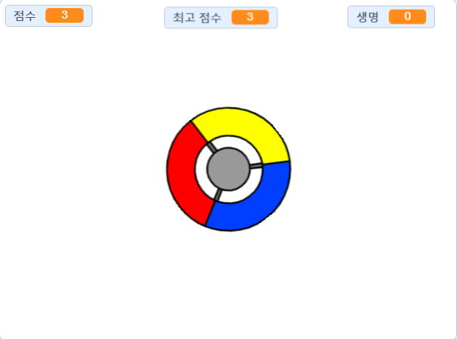

--- no-print ---

이 프로젝트는 **스크래치3**버전입니다. [스크래치2 버전의 프로젝트](https://projects.raspberrypi.org/ko-KR/projects/catch-the-dots-scratch2)도 있습니다.

--- /no-print ---

## 들어가며

이번 프로젝트에서는 게임을 만드는 법을 배울 것입니다. 이 게임에서 플레이어는 점의 색깔과 조종기의 색깔을 알맞게 짝지어야합니다.

--- no-print ---

방향키를 이용해 조종기를 움직여 날아다니는 점들이 조종기 중앙에 올 수 있도록 조작하세요. 점을 3개 놓치게 되면 게임은 끝나게 됩니다.

  <iframe allowtransparency="true" width="485" height="402" src="https://scratch.mit.edu/projects/embed/399130705/?autostart=false" frameborder="0" scrolling="no"></iframe>
  

--- /no-print ---

--- print-only ---

--- /print-only ---

--- collapse ---
---
title: 다음과 같은 내용을 배우게 됩니다
---

+ 목록에서 아이템을 랜덤으로 고르는 방법
+ 속도, 생명, 그리고 플레이어의 점수를 나타내기 위한 변수 사용법

--- /collapse ---

--- collapse ---
---
title: 준비물
---

### 하드웨어

+ 스크래치 3을 실행할 수 있는 컴퓨터

### 소프트웨어

+ 스크래치 3 ([온라인](http://rpf.io/scratchon){:target="_blank"} 또는 [오프라인](http://rpf.io/scratchoff){:target="_blank"})

### 다운로드 목록

+ [오프라인 스크래치 2 프로젝트](http://rpf.io/p/ko-KR/catch-the-dots-go){:target="_blank"}

--- /collapse ---

--- collapse ---
---
title: 교육자를 위한 참고사항
---

--- no-print ---

이 프로젝트를 인쇄하려면, [프린트용 버전](https://projects.raspberrypi.org/ko-KR/projects/catch-the-dots/print)을 사용하십시오.

--- /no-print ---

완성된 프로젝트는 [여기서](http://rpf.io/p/ko-KR/catch-the-dots-get){:target="_blank"} 확인하실 수 있습니다.

완료된 프로젝트는 [여기서](https://scratch.mit.edu/projects/252923761/#editor){:target="_blank"} 확인하실 수 있습니다.

--- /collapse ---