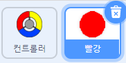
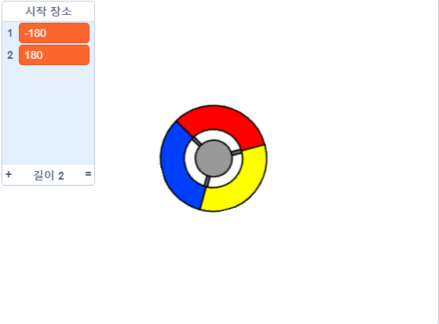
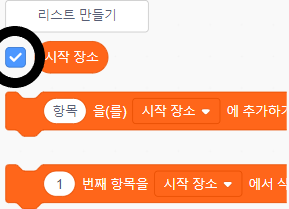

## 점수를 얻거나 생명을 잃거나

이제 여러분은 플레이어가 모아야 하는 여러 개의 점들을 추가할 것입니다.

\--- task \---

'빨간색'의 새로운 스프라이트를 만들어 주세요. 이 스프라이트는 조그마한 빨간색 점이 될 것입니다.



\--- /task \---

\--- task \---

매 초마다 '빨강'변수의 복제품을 만들기 위해서 '빨강'변수에 밑의 스크립트를 추가해 주세요.


```blocks3
    ⚑ 클릭했을 때
숨기기
(2) 초 기다리기
무한 반복하기 
  (myself v) 복제하기
  ((5) 부터 (10) 사이의 임의의 수) 초 기다리기
end
```

\--- /task \---

이제 초록색 깃발을 클릭하면, 아무것도 일어나지 않습니다. 왜냐하면 복제된 스프라이트는 매번 같은 곳에서 나타나기 때문에 숨겨져 있는 것처럼 보이기 때문입니다.

이제 이 클론들이 같은 장소가 아닌 무대 4군데에 위치한 코너에 나타나도록 코드를 재구성합시다.


\--- task \---

`시작 위치`{:class="block3variables"} 리스트를 만듭니다. 리스트의 `(+)` 아이콘을 클릭하고 변수 값을 `-180`{:class="block3variables"} 과 `180`{:class="block3variables"} 으로 추가합니다.




[[[generic-scratch3-make-list]]]

그 다음에 이 박스를 선택하지 않는 것으로 리스트를 숨길 수 있습니다:



\--- /task \---

무대 내 좌표는 `180` 부터 `-180` 까지 할당됨을 기억하십시오. 이 의미는 여러분들은 목록을 이용해서 모서리를 무작위로 선택할 수 있다는 것입니다.

\--- task \---

이 코드를 '점' 스프라이트에 추가하여 각각의 새로운 스프라이트 복제본이 무작위의 모서리에 나타나도록 한 다음 컨트롤러 스프라이트쪽으로 천천히 이동하십시오.


```blocks3
    when I start as a clone
    go to x: (item (pick random (1) to (2)) of [start positions v]) y: (item (pick random (1) to (2)) of [start positions v])
    point towards (controller v)
    show
    repeat until <touching (controller v)?>
        move (1) steps
    end
```

\--- /task \---

이 새로운 코드는 ` -180` 또는 ` 180 ` x 및 y 위치의 경우, 각 '점'스프라이트 클론이 스테이지의 모서리에서 시작됨을 의미합니다.

\--- task \---

프로젝트를 테스트하십시오. 스테이지 모서리에 빨간색 점이 나타나고 컨트롤러쪽으로 천천히 움직입니다.


\--- /task \---

\--- task \---

`생명`{: class = "block3variables"} 과 `점수`{: class = "block3variables"}라는 두 개의 새 변수를 만듭니다.


\--- /task \---

\--- task \---

스테이지에 코드를 추가하여 게임이 시작할 때의 변수를 설정되도록 하세요`생명`{:class="block3variables"} `3`으로 그리고 `점수`{:class="block3variables"} `0`으로 

```blocks3
when flag clicked
set [lives v] to (3)
set [score v] to (0)
```

\--- /task \---

\--- task \---

플레이어가 마지막 생명을 잃을 때 게임을 끝내려면 스테이지의 스크립트 끝에 이 코드를 추가하십시오.


```blocks3
    wait until <(lives :: variables) < [1]>
    stop [all v]
```

\--- /task \---

플레이어는 점을 잡아 포인트를 획득하며, 점을 잡지 못하면 생명을 잃습니다. 점은 컨트롤러의 색을 점의 색과 일치 시켜야만 잡을 수 있습니다.

\--- task \---

'빨간색'도트 스프라이트의 스크립트 영역으로 돌아가서 복제본으로 시작할 때 스프라이트 `의 끝에 코드 블록을 추가하십시오. ` {: class = "block3control"} 스크립트.

먼저, 컨트롤러와 겹치도록 복제된 점을 ` 5 단계로 이동 `{: class = "block3motion"}

컨트롤러와 색깔이 일치하면 `1`을 `점수`{:class="block3variables"}에 더하고, 컨트롤러와 색깔이 다르면 `1`을 `생명`{:class="block3variables"}에서 빼는 코드를 추가하십시오.

[[[generic-scratch3-sound-from-library]]]


```blocks3
    move (5) steps
    if <touching color [#FF0000]?> then
        change [score v] by (1)
        play sound (pop v) until done
    else
        change [lives v] by (-1)
        play sound (Laser1 v) until done
    end
    delete this clone
```

\--- /task \---

\--- task \---

게임을 테스트하여 다음을 확인하십시오.

1. 점의 색상과 컨트롤러의 색상이 일치하지 않으면 생명을 잃게됩니다.
2. 점의 색상과 일치하면 점수를 얻습니다.

\--- /task \---