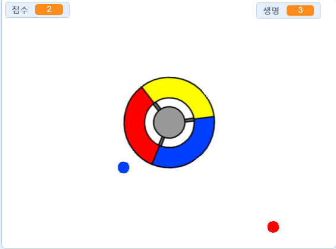

## 더 많은 점 만들기

--- task ---

빨간 점 스프라이트를 두 번 복제하고 이름을 '노랑'과 '파랑'으로 설정하세요.


--- /task ---

--- task ---

각 스프라이트의 색을 알맞게 설정하세요. 예를 들면 노랑 스프라이트는 노란색이어야 하고, 파랑 스프라이트는 파란색이어야 합니다.

--- /task ---

--- task ---

각 스프라이트의 코드를 바꿔서 플레이어가 점수를 얻기 위해서 컨트롤러의 색과 점 복제본의 색을 맞추게 하세요.



--- hints ---


--- hint ---

이것은 새로운 스프라이트에 들어가야 할 코드입니다.


```blocks3
if <touching color [#FF0000]?> then
		change [점수 v] by (1)
		play sound (pop v)
...
end
```

--- /hint ---

--- hint ---

이것은 당신이 노랑 스프라이트에 넣어야 할 코드입니다:

```blocks3
if <touching color [#FFFF00]? :: +> then
change [점수 v] by (1)
play sound (pop v)
end
```

이것은 당신이 파랑 스프라이트에 넣어야 할 코드입니다:

```blocks3
if <touching color [#0000FF]? :: +> then
change [점수 v] by (1)
play sound (pop v)
end
```

--- /hint ---

--- /hints ---

--- /task ---

만약 당신이 지금 게임을 플레이하면 가끔 점들이 서로의 위에 생성되는 것을 볼 수 있습니다.

--- task ---

'노랑' 점 스프라이트의 코드를 바꿔서 깃발이 클릭되고 4초 후에 나타나게 하세요.


```blocks3
    when flag clicked
	  hide
+	  wait (4) seconds
```


그 다음, '파랑' 점 스프라이트의 코드를 바꿔서 깃발이 클릭되고 6초 후에 나타나게 하세요.

--- /task ---