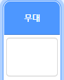
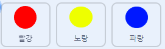

## 난이도 올리기

이제 당신은 게임이 진행될수록 게임이 더 어려워지게 만들겁니다. 점들이 점점 더 빠르게 나타나게 하면 게임이 어려워질 것입니다.

\--- task \---

Create a new `variable`{:class="block3variables"} called 'delay'.



\--- /task \---

\--- task \---

Go to the Stage's Scripts area and create a new script that sets the `delay`{:class="block3variables"} variable to `8` and then slowly reduces the value of `delay`{:class="block3variables"} while the game runs.


```blocks3
    ⚑ 클릭했을 때
[delay v] 을\(를\) (8) 로 정하기
<(delay) = (2)> 까지 반복하기 
  (10) 초 기다리기
  [delay v] 을\(를\) (-0.5) 만큼 바꾸기
end
```

\--- /task \---

Notice that this code is very similar to the code you would use to create a countdown timer!

Next, use the `delay`{:class="block3variables"} variable in the code scripts of the 'red', 'yellow', and 'blue' sprites.

\--- task \---

Remove the code block that makes the game wait a random number of seconds between making the dot sprite clones. Replace the block you've removed with your new `delay`{:class="block3variables"} variable:



```blocks3
<br />((5) 부터 (10) 사이의 난수) 초 기다리기
(delay :: variables) 초 기다리기
```

Do this for all three dot sprites.

\--- /task \---

\--- task \---

Test the game, and check whether the dots begin to appear more quickly as the game goes on.

+ 세가지 색의 점들 모두에서 제대로 작동하나요?
+ Can you see that the value of the `delay`{:class="block3variables"} variable decreases?

\--- /task \---