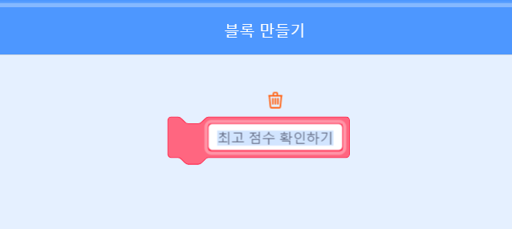

## 높은 점수

당신은 게임의 최고점수을 저장해서 플레이어들이 얼마나 잘 하고 있는지 볼 수 있게 할 것입니다.

\--- task \---

Create a new variable called `high score`{:class="block3variables"}.


\--- /task \---

\--- task \---

Select the Stage. Click on 'My blocks' and create a new custom block called `check high score`{:class="block3myblocks"}.




\--- /task \---

\--- task \---

Add code to your custom block so that the block checks if the current value of `score`{:class="block3variables"} in larger than the value of the `high score`{:class="block3variables"} variable, and then stores the value of `score`{:class="block3variables"} as the new value of `high score`{:class="block3variables"}.


```blocks3
    최고 점수 정의하기
   만약 <(점수)>(최고 점수)> 이라면
      [최고 점수] 를 (점수) 로 바꾸기
   끝
```

\--- /task \---

\--- task \---

Add your new custom block to the Stage script before the end of the script.


```blocks3
⚑ 클릭했을 때
[lives v] 을\(를\) (3) 로 정하기
[score v] 을\(를\) (0) 로 정하기
<(lives) < (1)> 까지 기다리기

+ 최고 점수를 확인하려면 
stop [all v]
```

\--- /task \---

\--- task \---

Play your game twice to check whether your score gets correctly saved as the `high score`{:class="block3variables"}.

\--- /task \---