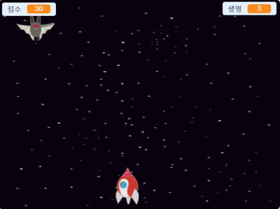

## 더 나아가기

다음 프로젝트로 [클론 전쟁 clone wars](https://projects.raspberrypi.org/en/projects/clone-wars?utm_source=pathway&utm_medium=whatnext&utm_campaign=projects)를 해보세요. 이 프로젝트는 우주의 몬스터들로 부터 지구를 지키는 게임을 만드는 것입니다. 이 프로젝트에서 여러분이 배웠던 요정들을 복제하고, 점수를 합산하는 것을 이용하게 될것입니다.

\--- no-print \---

Click the green flag in the example game below to start, and then press the <kbd>left</kbd> and <kbd>right</kbd> arrow keys to move the spaceship, and the <kbd>space</kbd> key to shoot.

  <iframe allowtransparency="true" width="485" height="402" src="https://scratch.mit.edu/projects/embed/276887163/?autostart=false" frameborder="0" scrolling="no"></iframe>
  

\--- /no-print \---

Score as many points as you can by shooting flying space-hippos. If you get hit by a hippo or by an orange dropped by the bats, you lose a life.

\--- print-only \---

\--- /print-only \---