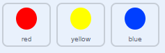

## अडचण वाढवा

आता आपण खेळाडू जितका जास्त वेळ खेळत राहील तितका गेम अधिक कठीण बनवणार आहात. काही वेळेने ठिपके लवकर लवकर येतील असे करू शकतो.

\--- task \---

नवीन 'delay' नावच `variable`{:class="block3variables"} तयार करा.


\--- /task \---

\--- task \---

स्टेजच्या स्क्रिप्ट्समध्ये जा आणि नवीन स्क्रिप्ट तयार करा जे `delay` चलला{:class="block3variables"}`8` वर ठेवेल आणि नंतर खेळ चालू असताना हळूहळू `delay` {:class="block3variables"} चे मूल्य कमी करेल.


```blocks3
    when flag clicked
    set [delay v] to (8)
    repeat until < (delay) = (2)>
        wait (10) seconds
        change [delay v] by (-0.5)
    end
```

\--- /task \---

लक्षात घ्या की हा कोड आपण काउंटडाउन टाइमर तयार करण्यासाठी वापरत असलेल्या कोडसारखेच आहे!

पुढे, `delay`{:class="block3variables"} चल 'red', 'yellow', आणि 'blue' स्प्राइटच्या कोड स्क्रिप्टमध्ये वापर.

\--- task \---

जे गेमला डॉट स्प्राइट प्रत बनवण्याच्या वेळेला थांबत आहे तो कोड ब्लॉक काढा. आपण काढलेल्या ब्लॉकला आपल्या नवीन `delay`{:class="block3variables"} चल सोबत बदला:



```blocks3
<br />-   wait (pick random (5) to (10)) secs
    wait (delay :: variables) secs
```

तीनही डॉट स्प्राइट्ससाठी हे करा.

\--- /task \---

\--- task \---

खेळ सुरू होताच ठिपके लवकर लवकर येत आहेत कि नाही ते तपासा.

+ हे तीनही रंगांच्या ठिपक्यांसाठी काम करते का?
+ आपण `delay`{:class="block3variables"} चलाचे मूल्य कमी होताना पाहू शकता का?

\--- /task \---