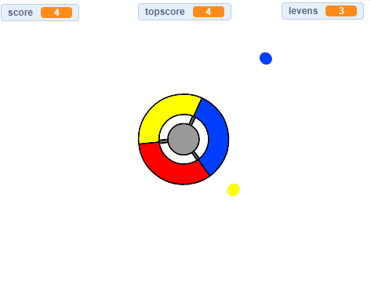

\--- no-print \---

Dit is de **Scratch 3** versie van het project. Er is ook een [Scratch 2 versie van dit project](https://projects.raspberrypi.org/en/projects/catch-the-dots-scratch2).

\--- /no-print \---

## Inleiding

In dit project leer je hoe je een spel maakt waarbij je gekleurde stippen moet paren met de juiste kleur van het controllerwiel.

\--- no-print \---

Use the arrow keys on your keyboard to rotate the controller wheel and catch the flying dots as they reach the centre. If you miss three dots, the game is over.

  <iframe allowtransparency="true" width="485" height="402" src="https://scratch.mit.edu/projects/embed/252923761/?autostart=false" frameborder="0" scrolling="no"></iframe>
  

\--- /no-print \---

\--- print-only \---

\--- /print-only \---

## \--- collapse \---

## title: Wat ga je leren

+ Hoe je willekeurige items uit een lijst kiest
+ Hoe je variabelen gebruikt om snelheid, levens en de score van de speler te volgen

\--- /collapse \---

## \--- collapse \---

## title: Wat heb je nodig

### Hardware

+ Een computer die Scratch 3 kan uitvoeren

### Software

+ Scratch 3 (of [online](http://rpf.io/scratchon){:target="_blank"} of [offline](http://rpf.io/scratchoff){:target="_blank"})

### Downloads

+ [Offline Scratch 2 project](http://rpf.io/p/en/catch-the-dots-go){:target="_blank"}

\--- /collapse \---

## \--- collapse \---

## title: Aanvullende informatie voor docenten

\--- no-print \---

If you need to print this project, please use the [printer-friendly version](https://projects.raspberrypi.org/en/projects/catch-the-dots/print).

\--- /no-print \---

You can find [the completed project here](http://rpf.io/p/en/catch-the-dots-get){:target="_blank"}.

You can find the [completed project here](https://scratch.mit.edu/projects/252923761/#editor){:target="_blank"}

\--- /collapse \---