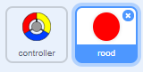
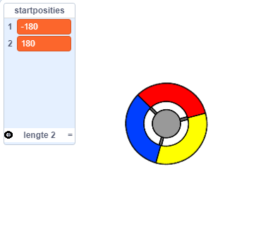
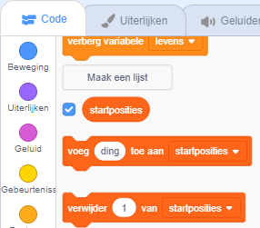

## Verdien punten of verlies een leven

Nu ga je een aantal stippen toevoegen die de speler moet verzamelen.

--- task --- Maak een nieuwe sprite met de naam 'rood'. Deze sprite zou een kleine rode stip moeten zijn.



--- /task ---

--- task --- Voeg dit script toe aan de 'rode' sprite, om elke paar seconden een nieuwe stipkloon te maken:


```blocks3
    wanneer groene vlag wordt aangeklikt
verdwijn
wacht (2) sec.
herhaal 
maak kloon van (mijzelf v)
wacht (willekeurig getal tussen (5) en (10)) sec.
end
```

--- /task ---

Als je nu op de groene vlag klikt lijkt het alsof er niets gebeurt. Dit komt omdat alle gekloonde sprites verborgen zijn, en ze verschijnen op dezelfde plek.

Jij gaat code toevoegen om iedere nieuwe kloon in een van de vier hoeken van het speelveld te laten verschijnen.


--- task --- Maak een nieuwe lijst met de naam `startposities`{:class="block3variables"}, klik op het pictogram `(+)` van de lijst om de waarden `-180`{:class="block3variables"} en `180` {:class="block3variables"} toe te voegen.




[[[generic-scratch3-make-list]]]

Vervolgens kun je de lijst verbergen door dit selectievakje uit te schakelen:

 --- /task ---

Merk op dat de coördinaat voor elke hoek van het speelveld een combinatie is van `180` en `-180`. Dit betekent dat je de lijst kunt gebruiken om willekeurig een hoek van het speelveld te kiezen.

--- task --- Voeg deze code toe aan de 'stip'-sprite om elke nieuwe sprite-kloon in een willekeurige hoek te laten verschijnen en deze langzaam naar de controller sprite te laten gaan.


```blocks3
    wanneer ik als kloon start
ga naar x: (item (willekeurig getal tussen (1) en (2)) van [startposities v]) y: (item (willekeurig getal tussen (1) en (2)) van [startposities v])
richt naar (controller v)
verschijn
herhaal tot <touching (controller v)?> 
neem (1) stappen
end
```

--- /task --- Deze nieuwe code kiest `-180` of `180` voor de x- en y-posities, wat betekent dat elke stip-kloon in een hoek van het werkgebied begint.

--- task --- Test je project. Je zou in elke hoek van het scherm rode stippen moeten zien verschijnen die langzaam naar de controller bewegen.

 --- /task ---

--- task --- Maak twee nieuwe variabelen met de naam `levens`{:class="block3variables"} en `score`{:class="block3variables"}.

 --- /task ---

--- task --- Voeg code toe aan het speelveld om aan het begin van het spel `levens`{:class="block3variables"} op `3` en `score`{:class="block3variables"} op `0` te zetten. 

```blocks3
wanneer groene vlag wordt aangeklikt
maak [levens v] (3)
maak [score v] (0)
```

--- /task ---

--- task --- Voeg deze code aan het einde van het script van het speelveld toe zodat het spel eindigt als de speler al zijn levens verloren heeft:


```blocks3
    wacht tot <(lives) < [1]>
stop [alle v]
```

--- /task ---

De speler moet punten winnen voor het vangen van stippen en moet levens verliezen als hij de stippen niet kan vangen. Een stip kan alleen worden gevangen door de kleur van de controller aan te passen aan de kleur van de stip.

--- task --- Ga terug naar het scriptgedeelte van de 'rode' stip sprite om een aantal codeblokken toe te voegen aan het einde van de van het blok `wanneer ik als kloon start`:class="block3control"} script.

Laat de stip-kloon eerst `neem 5 stappen`{:class="block3motion"} verplaatsen, zodat deze overlapt met de controller.

Voeg vervolgens code toe om `1` toe te voegen aan `score`{:class="block3variables"} als de kleur van de stip-kloon overeenkomt met de kleur van de controller wanneer deze geraakt wordt, of haal `1` weg van `levens`{:class="block3variables"} als hun kleuren niet overeenkomen.

[[[generic-scratch3-sound-from-library]]]


```blocks3
    neem (5) stappen
als <touching color [#FF0000]?> dan 
verander [score v] met (1)
start geluid (pop v) en wacht
anders
verander [levens v] met (-1)
start geluid (Laser1 v) en wacht
end
verwijder deze kloon
```

--- /task ---

--- task ---

Test je spel om zeker te weten dat:

1. Je een leven verliest als je een verkeerde kleur stip vangt
2. Je een punt scoort als je de goede kleur stip vangt

--- /task ---