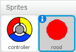
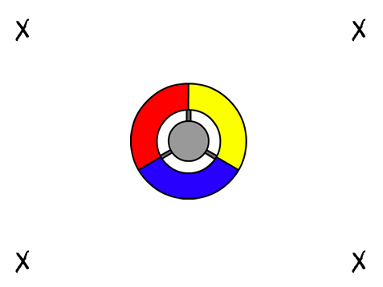
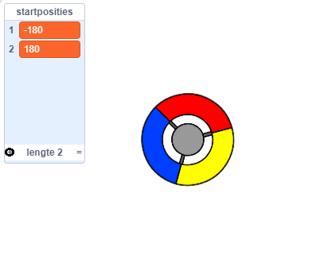
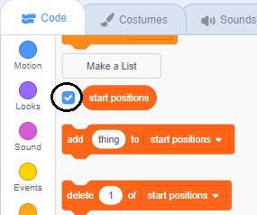
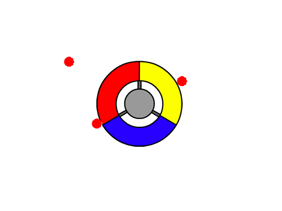
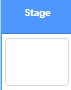

## Verdien punten of verlies een leven

Nu ga je een aantal stippen toevoegen die de speler moet verzamelen.

--- task ---

Maak een nieuwe sprite met de naam 'rood'. Deze sprite zou een kleine rode stip moeten zijn.



--- /task ---

--- task ---

Voeg deze code toe aan je 'rode' sprite om elke paar seconden een nieuwe kloon te maken:


```blocks3
    when flag clicked
	  hide
	  wait (2) seconds
	  forever
		  create clone of (mijzelf v)
		  wait (pick random (5) to (10)) secs
	  end
```

--- /task ---

Als je nu op de groene vlag klikt lijkt het alsof er niets gebeurt. Dit komt omdat alle gekloonde sprites verborgen zijn, en ze verschijnen op dezelfde plek.

Jij gaat code toevoegen om iedere nieuwe kloon in een van de vier hoeken van het speelveld te laten verschijnen.



--- task ---

Maak een nieuwe lijst genaamd `startposities`{:class="block3variables"}, klik op het `(+)` icoontje in de lijst om de waarden `-180`{:class="block3variables"} en `180`{:class="block3variables"} toe te voegen.




[[[generic-scratch3-make-list]]]

Vervolgens kun je de lijst verbergen door dit selectievakje uit te schakelen:



--- /task ---

Merk op dat de coördinaat voor elke hoek van het speelveld een combinatie is van `180` en `-180`. Dit betekent dat je de lijst kunt gebruiken om willekeurig een hoek van het speelveld te kiezen.

--- task ---

Voeg deze code toe aan de 'stippen' sprite om elke nieuwe sprite kloon in een willekeurige hoek te laten verschijnen en richting de controller te laten bewegen.


```blocks3
	when I start as a clone
	go to x: (item (pick random (1) to (2)) of [startposities v]) y: (item (pick random (1) to (2)) of [startposities v])
	point towards (controller v)
	show
	repeat until <touching (controller v)?>
		move (1) steps
	end
```

--- /task ---

Deze nieuwe code kiest of `-180` of `180` voor de x en y posities, wat inhoudt dat elke 'stip' sprite kloon in een hoek van het speelveld begint.

--- task ---

Test je project. Je zou in elke hoek van het scherm rode stippen moeten zien verschijnen die langzaam naar de controller bewegen.



--- /task ---

--- task ---

Maak twee nieuwe variabelen genaamd `levens`{:class="block3variables"} en `score`{:class="block3variables"}.


--- /task ---

--- task ---

Voeg code aan het Speelveld toe om de `levens`{:class="block3variables"} variabele op `3` en de `score`{:class="block3variables"} op `0` te zetten aan het begin van het spel. 

```blocks3
when flag clicked
set [levens v] to (3)
set [score v] to (0)
```

--- /task ---

--- task ---

Voeg deze code toe aan het eind van het script van het Speelveld om het spel te beëindigen als de speler de laatste van zijn levens verliest:


```blocks3
	wait until <(levens) < [1]>
	stop [alle v]
```

--- /task ---

De speler moet punten winnen voor het vangen van stippen en moet levens verliezen als hij de stippen niet kan vangen. Een stip kan alleen worden gevangen door de kleur van de controller aan te passen aan de kleur van de stip.

--- task ---

Ga terug naar het script van de 'rode' stip om wat codeblokken toe te voegen aan het eind van het `wanneer ik als kloon start`{:class="block3control"} script.

Laat de stip kloon eerst `neem 5 stappen`{:class="block3motion"} verplaatsen, zodat deze overlapt met de controller.

Voeg vervolgens code toe om `1` toe te voegen aan `score`{:class="block3variables"} als de kleur van de stip kloon overeenkomt met de kleur van de controller wanneer deze geraakt wordt, of haal `1` weg van `levens`{:class="block3variables"} als hun kleuren niet overeenkomen.

[[[generic-scratch3-sound-from-library]]]


```blocks3
	move (5) steps
	if <touching color [#FF0000]?> then
		change [score v] by (1)
		play sound (pop v) until done
	else
		change [levens v] by (-1)
		play sound (Laser1 v) until done
	end
	delete this clone
```

--- /task ---

--- task ---

Test je spel om zeker te weten dat:

1. Je een leven verliest als je een verkeerde kleur stip vangt
2. Je een punt scoort als je de goede kleur stip vangt

--- /task ---