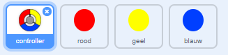
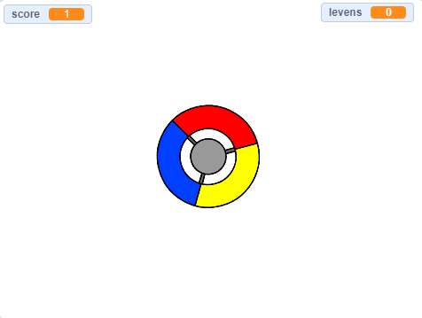

## Meer stippen

--- task ---

Dupliceer tweemaal je 'rode' stip sprite en noem de twee nieuwe sprites 'geel' en 'blauw'.



--- /task ---

--- task ---

Verander het uiterlijk van elke nieuwe sprite zodat het de juiste kleur heeft: de 'gele' sprite moet geel zijn, de 'blauwe' sprite moet blauw zijn.

--- /task ---

--- task ---

Verander de code van elke sprite zodat de speler de stip kloon op de juiste kleur op de controller moet plaatsen om punten te scoren.



--- hints ---


--- hint ---

Dit is de code die je nodig hebt voor het vinden en veranderen voor beide nieuwe sprites:


```blocks3
    if <touching color [#FF0000]?> then
		  change [score v] by (1)
		  play sound (pop v)
    end
```

--- /hint ---

--- hint ---

Zo verander je de code voor de gele sprite:

```blocks3
    als <raak ik kleur [#FFFF00]? :: +> dan
verander [score v] met (1)
start geluid (pop v)
end
```

Dit is hoe je de code voor de blauwe sprite moet veranderen:

```blocks3
    als <raak ik kleur [#0000FF]? :: +> dan
verander [score v] met (1)
start geluid (pop v)
end
```

--- /hint ---

--- /hints ---

--- /task ---

Als je het spel nu speelt, kun je zien dat de puntjes soms boven op elkaar worden geplaatst.

--- task ---

Verander de code voor de 'gele' stip sprite zodat het vier seconden wacht met verschijnen als op de groene vlag is geklikt.


```blocks3
    wanneer groene vlag wordt aangeklikt
verdwijn
+ wacht (4) sec.
```


Wijzig vervolgens de code voor de 'blauwe' stip sprite zodat deze 6 seconden wacht nadat op de groene vlag is geklikt voordat de sprite verschijnt.

--- /task ---
