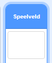
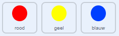

## Verhoog de moeilijkheid

Nu ga je het spel moeilijker maken naarmate de speler het langer speelt. Je doet dit door de stippen steeds sneller en sneller te laten verschijnen.

\--- task \--- Maak een nieuwe `variabele`{:class="block3variables"} genaamd 'vertraging'.

 \---/task\---

\--- task \--- Ga naar het scripts-gebied van het speelveld en maak een nieuw script aan dat de `vertraging`{:class="block3variables"} variabele instelt op `8` en verlaag vervolgens langzaam de waarde van `vertraging`{:class="block3variables"} terwijl het spel wordt gespeeld.


```blocks3
    wanneer groene vlag wordt aangeklikt
maak [vertraging v] (8)
herhaal tot < (vertraging) = (2)>
wacht (10) sec.
verander [vertraging v] met (-0.5)
end
```

\--- /task \---

Merk op dat deze code erg lijkt op de code die je zou gebruiken om een aftellende klok te maken!

Gebruik vervolgens de `vertraging`{:class="block3variables"} variabele in het code script van de 'rode', 'gele' en 'blauwe' sprites.

\--- task \--- Verwijder het codeblok waardoor het spel een willekeurig aantal seconden wacht tussen het maken van de stip-sprite-klonen. Vervang het blok dat je hebt verwijderd met je nieuwe `vertraging`{:class="block3variables"} variabele:



```blocks3
<br />- wacht (willekeurig getal tussen (5) en (10)) sec.
wacht (vertraging) sec.
```

Doe dit voor alle drie de stip-sprites.

-- /task \---

\--- task \--- Test het spel en controleer of de stippen sneller verschijnen als je het spel langer speelt.

+ Werkt dit voor alle drie gekleurde stippen?
+ Zie je dat de waarde van de `vertraging`{:class="block3variables"} variabele afneemt? \--- /task \---