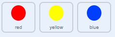

## Verhoog de moeilijkheid

Nu ga je het spel moeilijker maken naarmate de speler het langer speelt. Je doet dit door de stippen steeds sneller en sneller te laten verschijnen.

--- task ---

Maak een nieuwe `variabele`{:class="block3variables"} genaamd 'vertraging'.


--- /task ---

--- task ---

Ga naar het scripts gebied van het Speelveld en maak een nieuw script aan dat de `vertraging`{:class="block3variables"} variabele instelt op `8` en verlaag vervolgens langzaam de waarde van `vertraging`{:class="block3variables"} terwijl het spel wordt gespeeld.


```blocks3
	when flag clicked
	set [vertraging v] to (8)
	repeat until < (vertraging) = (2)>
		wait (10) seconds
		change [vertraging v] by (-0.5)
	end
```

--- /task ---

Merk op dat deze code erg lijkt op de code die je zou gebruiken om een aftellende klok te maken!

Gebruik vervolgens de `vertraging`{:class="block3variables"} variabele in het code script van de 'rode', 'gele' en 'blauwe' sprites.

--- task ---

Verwijder het codeblok waardoor het spel een willekeurig aantal seconden wacht tussen het maken van de stip sprite klonen. Vervang het blok dat je hebt verwijderd met je nieuwe `vertraging`{:class="block3variables"} variabele:



```blocks3
- 	wait (pick random (5) to (10)) secs
	wait (vertraging :: variables) secs
```

Doe dit voor alle drie de stip sprites.

--- /task ---

--- task ---

Test het spel en controleer of de stippen sneller verschijnen als je het spel langer speelt.

+ Werkt dit voor alle drie gekleurde stippen?
+ Zie je dat de waarde van de `vertraging`{:class="block3variables"} variabele afneemt?

--- /task ---