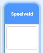

## Topscore

Je gaat de hoogste score van het spel opslaan, zodat spelers kunnen zien hoe goed ze het doen.

--- task --- Maak een nieuwe variabele met de naam `topscore`{:class="block3variables"}.



--- /task ---

--- task --- Selecteer het Speelveld. Klik op 'Mijn blokken' en maak een nieuw aangepast blok met de naam `controleer topscore `{:class="block3myblocks"}.

 

--- /task ---

--- task --- Voeg code toe aan je aangepaste blok, zodat het blok controleert of de huidige waarde van `score`{:class="block3variables"} groter is dan de waarde van de `topscore`{:class="block3variables"} variabele, en dan de waarde van `score`{:class="block3variables"} opslaat als de nieuwe waarde van `topscore `{:class="block3variables"}.


```blocks3
    definieer controleer topscore
als <(score) > (topscore)> dan 
maak [topscore v] (score)
end
```

--- /task ---

--- task --- Voeg je nieuwe aangepaste blok toe aan het speelveld-script vóór het einde van het script.


```blocks3

when flag clicked
set [levens v] to (3)
set [score v] to (0)
wait until <(lives) < (1)>
+ controleer topscore :: custom
stop [all v]
```

--- /task ---

--- task ---

Speel je game twee keer om te controleren of je score correct wordt opgeslagen als `topscore`{:class="block3variables"}.

--- /task ---
