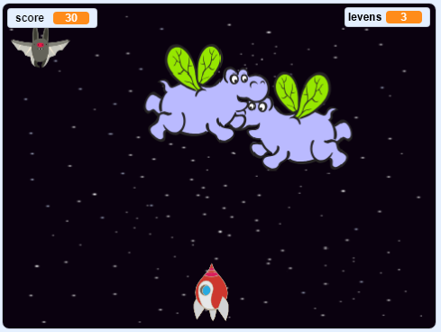

## Wat nu?

Try the [Clone wars](https://projects.raspberrypi.org/en/projects/clone-wars?utm_source=pathway&utm_medium=whatnext&utm_campaign=projects) project to make a game in which you have to save the Earth from space monsters. In dat project kun je gebruiken wat je hebt geleerd over het klonen van sprites en het toevoegen van een score!

\--- no-print \---

Klik op de groene vlag in het onderstaande voorbeeld om het spel te starten en druk vervolgens op de pijltjetoets <kbd>links</kbd> en <kbd>rechts</kbd>, om het ruimteschip in de <kbd>ruimte</kbd> te verplaatsen en druk op de spatiebalk om te schieten.

  <iframe allowtransparency="true" width="485" height="402" src="https://scratch.mit.edu/projects/embed/276887163/?autostart=false" frameborder="0" scrolling="no"></iframe>
  

\--- /no-print \---

Score as many points as you can by shooting flying space-hippos. If you get hit by a hippo or by an orange dropped by the bats, you lose a life.

\--- print-only \---

\--- /print-only \---