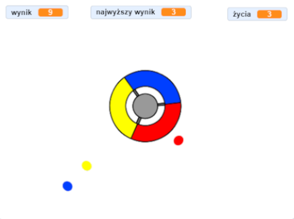

\--- no-print \---

To jest wersja projektu korzystająca z **Scratch 3**. Istnieje również [wersja tego projektu dla Scratch 2](https://projects.raspberrypi.org/en/projects/catch-the-dots-scratch2).

\--- /no-print \---

## Wprowadzenie

W tym projekcie nauczysz się jak stworzyć grę, w której gracz musi dopasować kolorowe kropki do właściwych części pokrętła kontrolera.

\--- no-print \---

Use the arrow keys on your keyboard to rotate the controller wheel and catch the flying dots as they reach the centre. If you miss three dots, the game is over.

  <iframe allowtransparency="true" width="485" height="402" src="https://scratch.mit.edu/projects/embed/252923761/?autostart=false" frameborder="0" scrolling="no"></iframe>
  

\--- /no-print \---

\--- print-only \---

\--- /print-only \---

## \--- collapse \---

## title: Czego się nauczysz

+ Jak wybrać losowe przedmioty z listy
+ Jak używać zmiennych do śledzenia prędkości, żyć i wyniku gracza

\--- /collapse \---

## \--- collapse \---

## title: Czego będziesz potrzebować

### Sprzęt

+ Komputer, na którym można uruchomić Scratch 3

### Oprogamowanie

+ Scratch 3 (either [online](https://rpf.io/scratchon){:target="_blank"} or [offline](https://rpf.io/scratchoff){:target="_blank"})

### Pliki do pobrania

+ [Offline Scratch 2 project](https://rpf.io/p/en/catch-the-dots-go){:target="_blank"}

\--- /collapse \---

## \--- collapse \---

## title: Dodatkowe informacje dla nauczycieli

\--- no-print \---

If you need to print this project, please use the [printer-friendly version](https://projects.raspberrypi.org/en/projects/catch-the-dots/print).

\--- /no-print \---

You can find [the completed project here](https://rpf.io/p/en/catch-the-dots-get){:target="_blank"}.

\--- /collapse \---