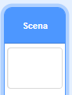

## Zdobądź punkty, albo strać życia

Teraz dodasz trochę kropek, które gracz musi zebrać.

Utwórz nowego duszka i nazwij go "czerwony". Ten duszek powinien być małą czerwoną kropką.


\--- /task \---

\---task\--- Dodaj ten skrypt do duszka kropki - "czerwony", aby tworzyć jego nowe kopie co kilka sekund:


```blocks3
    kiedy kliknięto zieloną flagę
  ukryj
  czekaj (2) s
  zawsze 
    sklonuj (siebie v)
    czekaj (losuj od (5) do (10)) s
  koniec
```

\--- /task \---

Jeżeli klikniesz teraz zieloną flagę, zobaczysz że nic się nie zdarzy. Dzieje się tak ponieważ wszystkie klony duszków są ukryte, i pojawiają się w tym samym miejscu.

Teraz dodasz kod sprawiający, że każdy nowy klon będzie się pojawiać w jednym z czterech rogów Sceny.


\--- task \--- Stwórz nową listę `pozycja początkowa`{:class="block3variables"}, kliknij na liście ikonę`(+)` aby dodać wartości `-180`{:class="block3variables"} oraz `180`{:class="block3variables"}.


[[[generic-scratch3-make-list]]]

Później możesz ukryć listę odznaczając to okienko:

 \--- /task \---

Zwróć uwagę że współrzędne każdego z rogów Sceny są kombinacją `180` oraz `-180`. Oznacza to, że możesz użyć listy do losowego wybrania narożnika Sceny.

\---task\--- Dodaj ten kod do duszka 'kropki' aby każdy nowy duszek-klon pojawiał się w losowym narożniku i powoli poruszał się w kierunku duszka pokrętła.


```blocks3
    kiedy zaczynam jako klon
  idź do x: (element (losuj od (1) do (2)) z [pozycja początkowa v]) y: (element (losuj od (1) do (2)) z [pozycja początkowa v])
  ustaw w stronę (pokrętło v)
  pokaż
  powtarzaj aż <touching (controller v)?> 
    przesuń o (1) kroków
  koniec
```

\--- /task \--- kod powyżej pozwala wybrać `-180` albo `180` dla pozycji x i y, co oznacza, że każdy klon 'kropki' zaczyna w jednym z rogów Sceny.

\---task\--- Wypróbuj swój kod. Powinieneś widzieć wiele czerwonych kropek pojawiających się w każdym rogu ekranu i poruszających się powoli w kierunku kontrolera.

 \--- /task \---

\--- task \--- Stwórz dwie nowe zmienne nazywające się `życia`{:class="block3variables"} oraz `wynik`{:class="block3variables"}.

 \--- /task \---

\--- task \--- Dodaj kod do swojej planszy, aby ustawić `życia`:class="block3variables"} na `3` i `wynik`{:class="block3variables"} na `0` na rozpoczęcie każdej gry. 

```blocks3
kiedy kliknięto zieloną flagę
ustaw [życia v] na (3)
ustaw [wynik v] na (0)
```

\--- /task \---

\--- task \--- Dodaj ten kod na końcu skrypty Sceny, aby gra kończyła się kiedy grasz straci ostatnie z żyć:


```blocks3
    czekaj aż <(życia) < [1]>
  zatrzymaj [wszystko v]
```

\--- /task \---

Gracz powinien wygrywać punkty za złapanie kropek, oraz powinien tracić życia za nie złapanie ich. Kropka może być złapana tylko przez kolor na kontrolerze pasujący do koloru kropki.

\--- task \--- Wróć do skryptu duszka kropki 'czerwony' i dodaj kilka bloczków na końcu skryptu `gdy zaczynam jako klon`{:class="block3control"}.

Najpierw spraw aby klon kropki `przesuń o 5 kroków`{:class="block3motion"}, tak by nachodził na kontroler.

Then add code to either add `1` to `score`{:class="block3variables"} if the colour of the dot clone matches the colour of the controller when they touch, or to take `1` away from `lives`{:class="block3variables"} if their colours don't match.

[[[generic-scratch3-sound-from-library]]]


```blocks3
    move (5) steps
    if <touching color [#FF0000]?> then
        change [score v] by (1)
        play sound (pop v) until done
    else
        change [lives v] by (-1)
        play sound (Laser1 v) until done
    end
    delete this clone
```

\--- /task \---

\--- task \---

Test your game to make sure that:

1. You lose a life if you don’t match a dot with the correct colour
2. You score a point if you match a dot correctly

\--- /task \---