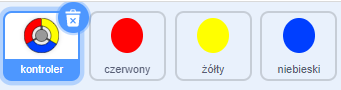
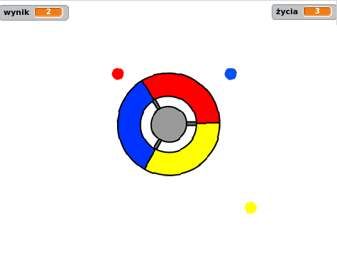

## Więcej kropek

--- task --- Dwukrotnie powiel swój „czerwony” duszek i nazwij dwa nowe duszki „żółtym” i „niebieskim”.

 --- /task ---

--- task --- Zmień kostium każdego nowego duszka, tak aby był prawidłowego koloru: „żółty” duszek powinien być żółty, a „niebieski” duszek powinien być niebieski. --- /task ---

--- task --- Zmień kod każdego ikonki, aby gracz musiał dopasować kropkę do odpowiedniego koloru kontrolera, aby zdobyć punkty.



--- hints ---
 --- hint --- Jest to kod, który musisz znaleźć i zmienić dla obu nowych ikonek:


```blocks3
    jeżeli <dotyka koloru [#FF0000] ?> to 
        zmień [wynik v] o (1)
        zagraj dźwięk (pop v)
...
    koniec
```

--- /hint --- --- hint --- W ten sposób należy zmienić kod żółtego ikonki:

```blocks3
    jeżeli <dotyka koloru [#FFFF00] ? :: +> to 
        zmień [wynik v] o (1)
        zagraj dźwięk (pop v)
    koniec
```

W ten sposób musisz zmienić kod niebieskiego duszka:

```blocks3
    jeżeli <dotyka koloru [#0000FF] ? :: +> to 
        zmień [wynik v] o (1)
        zagraj dźwięk (pop v)
    koniec
```

--- /hint --- --- /hints --- --- /task ---

Jeśli grasz teraz w tę grę, możesz zobaczyć, że czasami kropki są tworzone jedna na drugiej.

--- task --- Zmień kod duszka „żółtej” kropki, tak aby poczekał cztery sekundy po kliknięciu flagi przed pojawieniem się.


```blocks3
    kiedy kliknięto zieloną flagę
    ukryj
+   czekaj (4) sekund
```


Następnie zmień kod duszka „niebieskiej” kropki, tak aby poczekał 6 sekund po kliknięciu flagi przed pojawieniem się.

--- /task ---