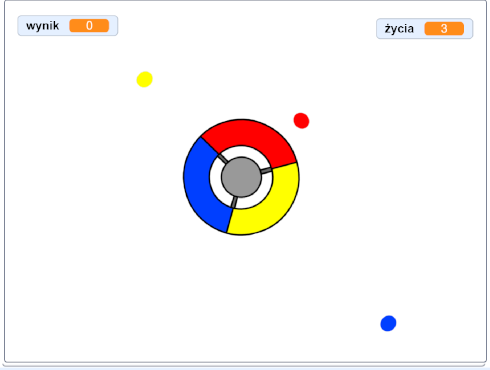

## Więcej kropek

\--- zadanie \--- Dwukrotnie powiel swój „czerwony” duszek i nazwij dwa nowe duszki „żółtym” i „niebieskim”.

 \--- /task \---

\--- zadanie \--- Zmień kostium każdego nowego duszka, tak aby był prawidłowego koloru: „żółty” duszek powinien być żółty, a „niebieski” duszek powinien być niebieski. \--- /task \---

\--- zadanie \--- Zmień kod każdego ikonki, aby gracz musiał dopasować kropkę do odpowiedniego koloru kontrolera, aby zdobyć punkty.



\--- wskazówki \--- \--- wskazówka \--- Jest to kod, który musisz znaleźć i zmienić dla obu nowych ikonek:


```blocks3
    jeśli <touching color [#FF0000]?> to
        zmienia [wynik v] przez (1)
        odtwarzanie dźwięku (pop v)
...
    koniec
```

\--- / wskazówka \--- \--- wskazówka \--- W ten sposób należy zmienić kod żółtego ikonki:

```blocks3
    jeśli <dotyka koloru [# FFFF00]? :: +> a następnie
        zmiana [wynik v] przez (1)
        odtwarzanie dźwięku (pop v)
    koniec
```

W ten sposób musisz zmienić kod niebieskiego duszka:

```blocks3
    jeśli <dotyka koloru [# 0000FF]? :: +> a następnie
        zmiana [wynik v] przez (1)
        odtwarzanie dźwięku (pop v)
    koniec
```

\--- /hint \--- \--- /hints \--- \--- /task \---

Jeśli grasz teraz w tę grę, możesz zobaczyć, że czasami kropki są tworzone jedna na drugiej.

\--- zadanie \--- Zmień kod „żółtego” kropka kropki, tak aby poczekał cztery sekundy po kliknięciu flagi przed pojawieniem się.


```blocks3
    po kliknięciu flagi
    ukryj
+ poczekaj (4) sekundy
```


Następnie zmień kod „niebieskiej” ikonki kropki, tak aby poczekał 6 sekund po kliknięciu flagi przed pojawieniem się.

\--- /task \---