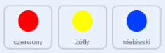

## Zwiększenie trudności

Teraz zrobisz grę tym trudniejszą, im dłużej gracz w nią gra. Osiągniesz to sprawiając, że kropki pojawią się coraz szybciej z upływem czasu.

\--- task \---

Create a new `variable`{:class="block3variables"} called 'delay'.


\--- /task \---

\--- task \---

Go to the Stage's Scripts area and create a new script that sets the `delay`{:class="block3variables"} variable to `8` and then slowly reduces the value of `delay`{:class="block3variables"} while the game runs.


```blocks3
    po kliknięciu flagi
    ustaw [opóźnienie v] na (8)
    powtórz do < (opóźnienie) = (2)>
        poczekaj (10) sekund
        zmień [opóźnienie v] o (-0,5)
    koniec
```

\--- /task \---

Notice that this code is very similar to the code you would use to create a countdown timer!

Next, use the `delay`{:class="block3variables"} variable in the code scripts of the 'red', 'yellow', and 'blue' sprites.

\--- task \---

Remove the code block that makes the game wait a random number of seconds between making the dot sprite clones. Replace the block you've removed with your new `delay`{:class="block3variables"} variable:



```blocks3
<br />- czekaj (wybierz losowe (5) do (10)) sek
    czekanie (opóźnienie :: zmienne) sek
```

Do this for all three dot sprites.

\--- /task \---

\--- task \---

Test the game, and check whether the dots begin to appear more quickly as the game goes on.

+ Czy to działa dla wszystkich trzech kolorów kropek?
+ Can you see that the value of the `delay`{:class="block3variables"} variable decreases?

\--- /task \---