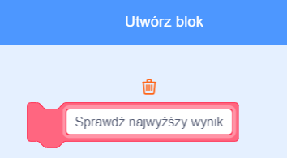

## Tabela wyników

Zachowasz rekord wyniku gry, aby gracze mogli zobaczyć, jak dobrze sobie radzą.

--- task --- Utwórz nową zmienną o nazwie `Najwyższy wynik`{:class="block3variables"}.


--- /task ---

--- task --- Wybierz scenę. Kliknij „Moje bloki” i utwórz nowy blok niestandardowy o nazwie `sprawdź najwyższy wynik`{:class="block3myblocks"}.

 

--- /task ---

--- task --- Dodaj kod do swojego bloku niestandardowego, aby blok sprawdzał, czy bieżąca wartość zmiennej `punkty`{:class="block3variables"} ma większą wartość niż `najwyższy wynik`{:class="block3variables"}, a następnie przechowuje wartość `wynik`{:class="block3variables"} jako nową wartość zmiennej `najwyższy wynik`{:class="block3variables"}.


```blocks3
definiuj sprawdź najwyższy wynik
jeżeli <(wynik :: variables) > (najwyższy wynik)> to 
  ustaw [najwyższy wynik v] na (wynik :: variables)
koniec
```

--- /task ---

--- task --- Dodaj nowy blok niestandardowy do skryptu sceny przed końcem skryptu.


```blocks3
kiedy kliknięto zieloną flagę
ustaw [życia v] na (3)
ustaw [wynik v] na (0)
czekaj aż <(życia) < (1)>
+ sprawdź najwyższy wynik :: custom
zatrzymaj [wszystko v]
```

--- /task ---

--- task ---

Zagraj w swoją grę dwa razy, aby sprawdzić, czy Twój wynik zostanie poprawnie zapisany jako `najwyższy wynik`{:class="block3variables"}.

--- /task ---