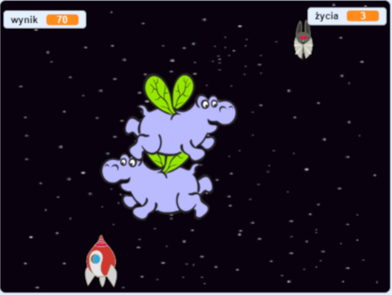

## Co dalej?

Wypróbuj projekt [Wojna klonów](https://projects.raspberrypi.org/en/projects/clone-wars?utm_source=pathway&utm_medium=whatnext&utm_campaign=projects), aby stworzyć grę, w której musisz uratować Ziemię przed kosmicznymi potworami. W tym projekcie będziesz mógł wykorzystać to, czego się dowiedziałeś o klonowaniu duszków i dodawaniu wyniku!

\--- no-print \---

Kliknij zieloną flagę w przykładowej grze poniżej, aby rozpocząć, a następnie naciśnij <kbd>lewą</kbd> i <kbd>prawą</kbd> strzałkę, aby przesunąć statek kosmiczny, i <kbd>spację</kbd>, aby strzelać.

  <iframe allowtransparency="true" width="485" height="402" src="https://scratch.mit.edu/projects/embed/276887163/?autostart=false" frameborder="0" scrolling="no"></iframe>
  

\--- /no-print \---

Zdobywaj jak najwięcej punktów, strzelając w latające kosmiczne hipopotamy. Jeśli zostaniesz uderzony przez hipopotama lub pomarańczę upuszczoną przez nietoperze, tracisz życie.

\--- print-only \---

\--- /print-only \---