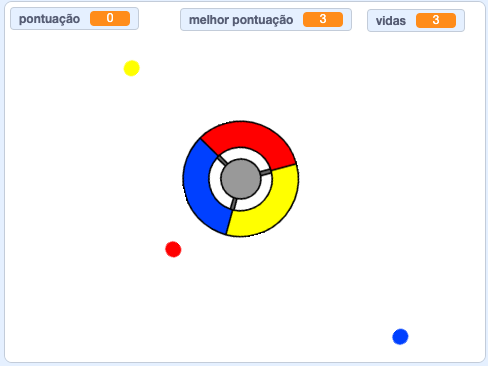

\--- no-print \---

Esta é a versão **Scratch 3** do projeto. There is also a [Scratch 2 version of the project](https://projects.raspberrypi.org/en/projects/catch-the-dots-scratch2).

\--- /no-print \---

## Introdução

Neste projeto você aprenderá como criar um jogo, onde deverá combinar os pontos coloridos às partes correspondentes do controlador.

\--- no-print \---

Use as teclas de seta no seu teclado para girar a roda do controlador e pegar os pontos voadores conforme eles chegam ao centro. Se você perder três pontos, o jogo acaba.

  <iframe allowtransparency="true" width="485" height="402" src="https://scratch.mit.edu/projects/embed/252923761/?autostart=false" frameborder="0" scrolling="no"></iframe>
  

\--- /no-print \---

\--- print-only \---

\--- /print-only \---

## \--- collapse \---

## title: O que você vai aprender

+ Como escolher itens aleatórios de uma lista
+ Como usar variavéis para rastrear velocidade, vidas, e a pontuaçāo do jogador

\--- /collapse \---

## \--- collapse \---

## título: O que você vai precisar

### Hardware

+ Um computador capaz de executar o Scratch 3

### Software

+ Scratch 3 ([online](http://rpf.io/scratchon){:target="_blank"} ou [offline](http://rpf.io/scratchoff){:target="_blank"})

### Downloads

+ [Projeto Scratch 2 offline](http://rpf.io/p/en/catch-the-dots-go){:target="_blank"}

\--- /collapse \---

## \--- collapse \---

## title: Notas adicionais para educadores

\--- no-print \---

Se precisar imprimir este projeto, por favor use [a versão para Impressão](https://projects.raspberrypi.org/en/projects/catch-the-dots/print).

\--- /no-print \---

Você pode encontrar o [projeto concluído aqui](http://rpf.io/p/en/catch-the-dots-get){:target="_blank"}.

\--- /collapse \---