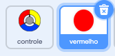
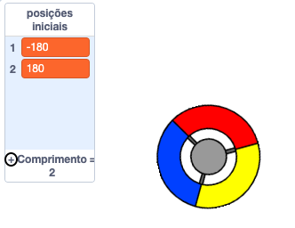

## Ganhe pontos ou perca vidas

Agora você vai adicionar algumas bolinhas que o jogador precisa capturar.

\--- task \---

Crie um novo ator chamado 'vermelho'. Esse ator deve ser um pequeno ponto vermelho.



\--- /task \---

\--- task \---

Adicione este script ao seu ator 'vermelho' para criar um novo clone do ator a cada poucos segundos:


```blocks3
    when flag clicked
    hide
    wait (2) seconds
    forever
        create clone of (myself v)
        wait (pick random (5) to (10)) secs
    end
```

\--- /task \---

Se você clicar na bandeira verde agora, parece que nada está acontecendo. Isto porque todos os atores clonados estão escondidos e aparecem no mesmo lugar.

Você vai adicionar código para fazer cada novo clone aparecer em um dos quatro cantos do Palco.


\--- task \---

Crie uma nova lista chamada `posições iniciais`{:class="block3variables"}, clique no ícone `(+)` da lista para adicionar os valores `-180`{:class="block3variables"} e `180`{:class="block3variables"}.




[[[generic-scratch3-make-list]]]

Em seguida, você pode ocultar a lista desmarcando esta caixa:


\--- /task \---

Note que as coordenadas para cada canto do Palco é uma combinaçāo de `180` e `-180`. Isso significa que você pode usar a lista para escolher um canto do Palco aleatoriamente.

\--- task \---

Adicione este código ao ator 'bolinha' para que cada novo clone apareça em um canto aleatório e se mova lentamente em direção ao ator controle.


```blocks3
    when I start as a clone
    go to x: (item (pick random (1) to (2)) of [start positions v]) y: (item (pick random (1) to (2)) of [start positions v])
    point towards (controller v)
    show
    repeat until <touching (controller v)?>
        move (1) steps
    end
```

\--- /task \---

Esse novo código escolhe `-180` ou `180` para as posições x e y, o que significa que cada clone do ator 'bolinha' começa em um canto do Palco.

\--- task \---

Teste seu projeto. Você deve ver bolinhas vermelhas aparecerem nos cantos do Palco e se moverem lentamente em direção ao controle.


\--- /task \---

\--- task \---

Crie duas novas variáveis chamadas `vidas`{:class="block3variables"} e `pontuação`{:class="block3variables"}.


\--- /task \---

\--- task \---

Adicione código ao seu Palco para definir a variável `vidas`{:class="block3variables"} para `3` e a `pontuação`{:class="block3variables"} para `0` no início do jogo. 

```blocks3
when flag clicked
set [lives v] to (3)
set [score v] to (0)
```

\--- /task \---

\--- task \---

Adicione este código ao final do script do Palco para fazer o jogo terminar quando o jogador perder a última vida:


```blocks3
    wait until <(lives :: variables) < [1]>
    stop [all v]
```

\--- /task \---

O jogador deve ganhar pontos por capturar as bolinhas. e deve perder vidas por falhar em capturá-las. Uma 'bolinha' só pode ser capturada se a cor do controle for a mesma da 'bolinha'.

\--- task \---

Volte para a área de Scripts do ator bolinha 'vermelha' para adicionar alguns blocos de código ao final do script `quando eu começar como um clone`{:class="block3control"}.

Primeiro, faça o clone da 'bolinha' `mova 5 passos`{:class="block3motion"} para que se sobreponha ao controle.

Depois adicione código para adicionar `1` à `pontuaçāo`{:class="block3variables"} se a cor do clone da 'bolinha' for a mesma que a do controle quando eles se tocam, ou para tirar `1` de `vidas`{:class="block3variables"} se as cores forem diferentes.

[[[generic-scratch3-sound-from-library]]]


```blocks3
    move (5) steps
    if <touching color [#FF0000]?> then
        change [score v] by (1)
        play sound (pop v) until done
    else
        change [lives v] by (-1)
        play sound (Laser1 v) until done
    end
    delete this clone
```

\--- /task \---

\--- task \---

Teste seu jogo para ter certeza que:

1. Você perde uma vida se não combinar uma bolinha com a cor correta
2. Você marca um ponto se combinar a cor correta

\--- /task \---