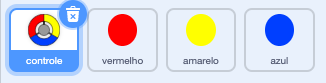

## Mais bolinhas

--- task ---

Duplique seu ator 'vermelho' duas vezes e nomeie os dois novos atores de 'amarelo' e 'azul'.



--- /task ---

--- task ---

Mude a fantasia de cada novo ator para que fique com a cor correta: o ator 'amarelo' deve ficar amarelo, e o ator 'azul' deve ser azul.

--- /task ---

--- task ---

Altere o código de cada ator para que o jogador tenha que combinar o clone da bolinha com a cor correta no controle para marcar pontos.


--- hints ---


--- hint ---

Este é o código que você precisa encontrar e alterar para os dois novos atores:


```blocks3
    if <touching color [#FF0000]?> then
        change [pontuação v] by (1)
        play sound (pop v)
        ...
    fim
```

--- /hint ---

--- hint ---

É assim que você precisa alterar o código para o ator amarelo:

```blocks3
    if <touching color [#FFFF00]? :: +> then
        change [pontuação v] by (1)
        play sound (pop v)
    end
```

É assim que você precisa alterar o código para o ator azul:

```blocks3
    if <touching color [#0000FF]? :: +> then
        change [pontuação v] by (1)
        play sound (pop v)
    end
```

--- /hint ---

--- /hints ---

--- /task ---

Se você jogar o jogo agora, você pode ver que as bolinhas às vezes são criadas uma em cima da outra.

--- task ---

Altere o código para o ator da bolinha 'amarelo' para que ele espere quatro segundos, após a bandeira ser clicada, antes de aparecer.


```blocks3
    when flag clicked
    hide
+   wait (4) seconds
```


Depois mude o código do ator da bolinha 'azul' para que espere 6 segundos, após a bandeira ser clicada, antes de aparecer.

--- /task ---