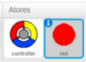
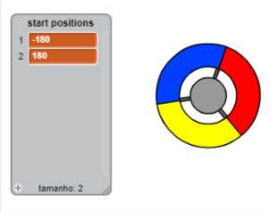
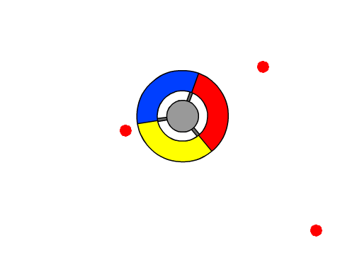

## Collecting dots

Let's add some dots for the player to collect with their controller.

+ Create a new sprite called 'red'. This sprite should be a small red dot.
    
    

+ Add this script to your 'red' dot sprite, to create a new dot clone every few seconds:
    
    ```blocks
        when flag clicked
        hide
        wait (2) secs
        forever
            create clone of [myself v]
            wait (pick random (5) to (10)) secs
        end
    ```

+ When each clone is created, you want it to appear in one of the 4 corners of the stage.
    
    
    
    To do this, first create a new **list** called `start positions`{:class="blockdata"} and click the `(+)` to add in the values `-180` and `180`.
    
    

+ You can use these 2 list items to pick a random corner of the stage. Add this code to the 'dot' sprite, so that each new clone moves to a random corner and then slowly moves towards the controller.
    
    ```blocks
        when I start as a clone
        go to x: (item (random v) of [start positions v]) y: (item (random v) of [start positions v])
        point towards [controller v]
        show
        repeat until <touching [controller v]?>
            move (1) steps
        end
    ```
    
    The code above chooses either `-180` or `180` for the x *and* y positions, meaning that each clone starts in one corner of the stage.

+ Test your project. You should see lots of red dots appear in each corner of the screen, and move slowly towards the controller.
    
    

+ Create 2 new variables called `lives`{:class="blockdata"} and `score`{:class="blockdata"}.

+ Add code to your stage to set the `lives`{:class="blockdata"} to 3 and the `score`{:class="blockdata"} to 0 at the start of the game.

+ You need to add code to the end of your red dot's `when I start as a clone`{:class="blockcontrol"} code, so that either 1 is added to the player's `score`{:class="blockdata"} if the colours match, or 1 is taken from the player's `lives`{:class="blockdata"} if the colours don't match.
    
    ```blocks
        move (5) steps
        if <touching color [#FF0000]?> then
            change [score v] by (1)
            play sound [pop v]
        else
            change [lives v] by (-1)
            play sound [laser1 v]
        end
        delete this clone
    ```

+ Add this code to the end of your stage's script, so that the game ends when the player loses all of their lives:
    
    ```blocks
        wait until <(lives) < [1]>
        stop [all v]
    ```

+ Test your game to make sure this code works as expected.